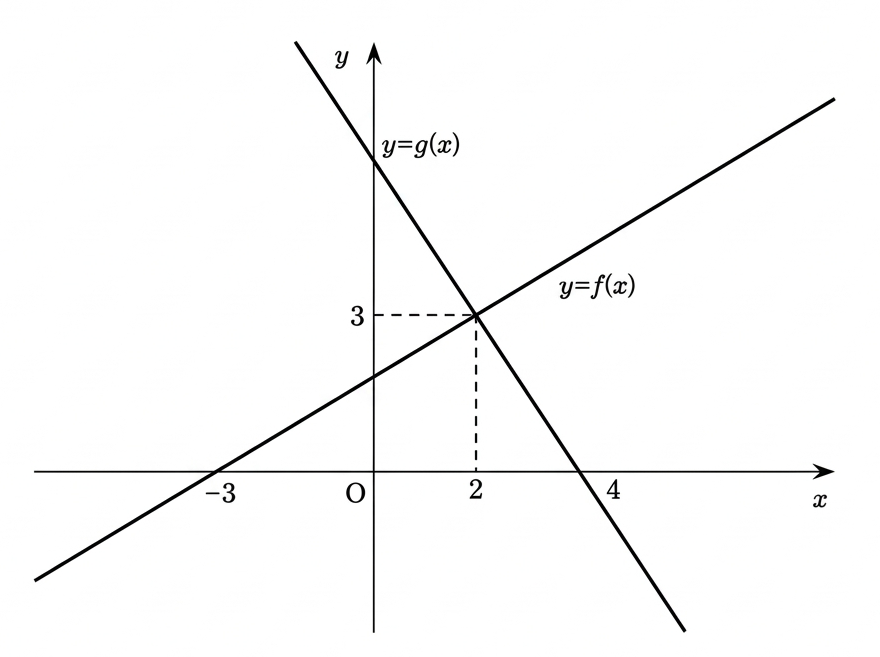

## Q
다음 그림의 일차함수 $y=f(x)$와 $y=g(x)$에 대하여
$$
\left(\frac{1}{3}\right)^{f(x)g(x)}
<
\left(\frac{1}{27}\right)^{f(x)}
$$
을 만족하는 정수 $x$값의 합을 구하면?

## Choices
① $-3$  
② $-2$  
③ $-1$  
④ $1$  
⑤ $2$

## Answer
②

## Solution
그림에서 $f(x)$는 $(-3,0)$, $(2,3)$을 지나므로
$$
f(x)=\frac{3}{5}(x+3)
$$
이고,

$g(x)$는 $(2,3)$, $(4,0)$을 지나므로
$$
g(x)=-\frac{3}{2}x+6
$$
이다.

또
$$
\left(\frac{1}{27}\right)^{f(x)}
=\left(\frac{1}{3}\right)^{3f(x)}
$$
이고 밑 $\frac{1}{3}$은 $1$보다 작으므로 지수의 대소가 반대로 되어
$$
f(x)g(x)>3f(x)
$$
즉
$$
f(x)\{g(x)-3\}>0
$$
이다.

여기서
$$
f(x)=\frac{3}{5}(x+3),\qquad
g(x)-3=-\frac{3}{2}(x-2)
$$
이므로
$$
\frac{3}{5}(x+3)\cdot\left(-\frac{3}{2}\right)(x-2)>0
$$
$$
\Longleftrightarrow (x+3)(x-2)<0
$$
따라서
$$
-3<x<2
$$
이다.

정수해는 $x=-2,-1,0,1$이고 합은
$$
-2
$$
이다.
