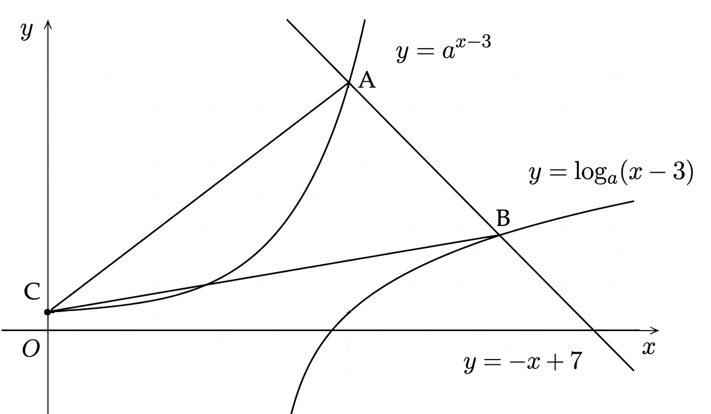

## Q
$a>1$인 실수 $a$에 대하여 직선 $y=-x+7$가 두 곡선
$$
y=a^{x-3},\qquad y=\log_a(x-3)
$$
과 만나는 점을 각각 $A$, $B$라 하고, $y=a^{x-3}$이 $y$축과 만나는 점을 $C$라 하자.

$\overline{AB}=2\sqrt2$일 때, 삼각형 $ABC$의 넓이를 $\dfrac{p}{q}$라 할 때 $p+q$의 값은?

## Choices
① $212$  
② $213$  
③ $214$  
④ $215$  
⑤ $216$

## Answer
④

## Solution
$A$를
$$
A=(u+3,\ 4-u)
$$
라 두면 $A$가 $y=a^{x-3}$ 위의 점이므로
$$
4-u=a^u
$$
이다.

$B$를
$$
B=(v+3,\ 4-v)
$$
라 두면 $B$가 $y=\log_a(x-3)$ 위의 점이므로
$$
4-v=\log_a v
\Longleftrightarrow v=a^{4-v}
$$
이다.

위 두 식을 비교하면 $u+v=4$이고,
$$
\overline{AB}
=\sqrt{(v-u)^2+(u-v)^2}
=\sqrt2\,|v-u|
$$
이므로
$$
2\sqrt2=\sqrt2\,|v-u|
\Longrightarrow |v-u|=2
$$
이다.

$u+v=4$, $|v-u|=2$에서 $\{u,v\}=\{1,3\}$인데,
$a>1$이므로 $4-u=a^u$를 만족하는 것은 $u=1$이다.
따라서
$$
a=3,\quad A=(4,3),\quad B=(6,1)
$$
이다.

$C$는 $x=0$일 때의 점이므로
$$
C=(0,\ a^{-3})=\left(0,\frac{1}{27}\right)
$$
이다.

이제 좌표로 넓이를 구하면
$$
[ABC]
=\frac12\left|
2\left(\frac{1}{27}-3\right)-(-2)(-4)
\right|
=\frac12\left|\,-\frac{376}{27}\right|
=\frac{188}{27}
$$
이다.

즉
$$
p=188,\ q=27
$$
이므로
$$
p+q=215
$$
이다.
