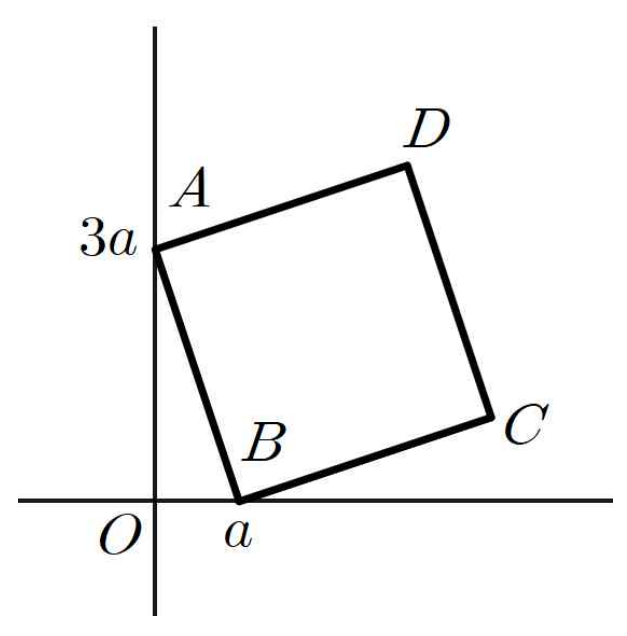

## Q
오른쪽 그림과 같이 두 점 \(A(0,3a)\), \(B(a,0)\)을 꼭짓점으로 하는 정사각형 \(ABCD\)에 대하여 이 사각형의 넓이를 이등분하고, 원점을 지나는 직선의 기울기는?

\[
\text{(단, 두 점 \(C\), \(D\)는 제1사분면 위의 점이고, \(a>0\)이다.)}
\]

## Choices
① \(\frac{1}{3}\)
② \(\frac{1}{2}\)
③ \(1\)
④ \(2\)
⑤ \(3\)

## Answer
③

## Solution
정사각형의 넓이를 이등분하는 직선은 정사각형의 중심을 지난다.

따라서 원점 \(O(0,0)\)와 정사각형의 중심을 지나는 직선의 기울기를 구하면 된다.

점 \(A(0,3a)\)에서 점 \(B(a,0)\)로 가면 \(x\)좌표는 \(a\)만큼 커지고 \(y\)좌표는 \(3a\)만큼 작아진다.

정사각형에서 서로 이웃한 두 변은 서로 수직이고 길이가 같으므로, 선분 \(BC\)는 오른쪽으로 \(3a\), 위로 \(a\)만큼 간 선분이 된다.

따라서
\[
C=(a+3a,0+a)=(4a,a)
\]
이다.

정사각형의 중심 \(M\)은 대각선 \(AC\)의 중점이므로
\[
M=\left(\frac{0+4a}{2},\frac{3a+a}{2}\right)=(2a,2a)
\]
이다.

그러므로 직선 \(OM\)의 기울기는
\[
\frac{2a-0}{2a-0}=1
\]
이다.

따라서 정답은 ③이다.
