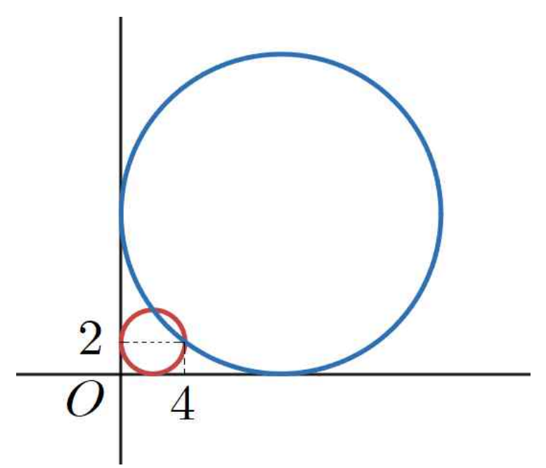

## Q
오른쪽 그림과 같이 점 \((4,2)\)을 지나고 \(x\)축과 \(y\)축에 동시에 접하는 원은 두 개가 있다. 이 두 원의 중심 사이의 거리는?

## Choices
① \(4\)
② \(4\sqrt{2}\)
③ \(8\)
④ \(6\sqrt{2}\)
⑤ \(8\sqrt{2}\)

## Answer
⑤

## Solution
\(x\)축과 \(y\)축에 동시에 접하는 원의 중심을
\[
(r,r)
\]
이라 하자.

이 원이 점 \((4,2)\)을 지나므로
\[
(4-r)^2+(2-r)^2=r^2
\]
이다.

정리하면
\[
16-8r+r^2+4-4r+r^2=r^2
\]
\[
r^2-12r+20=0
\]
\[
(r-2)(r-10)=0
\]
이므로
\[
r=2 \quad \text{또는} \quad r=10
\]
이다.

따라서 두 원의 중심은
\[
(2,2),\ (10,10)
\]
이고, 그 사이의 거리는
\[
\sqrt{(10-2)^2+(10-2)^2}
\]
\[
=\sqrt{8^2+8^2}
=8\sqrt{2}
\]
이다.

