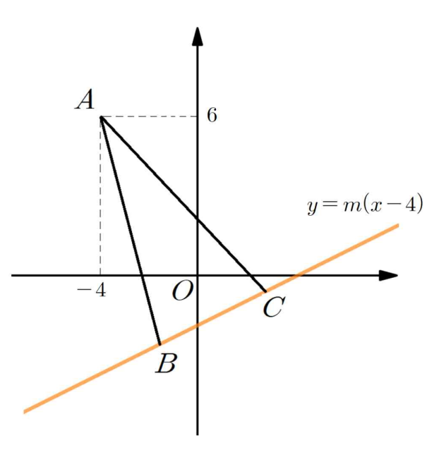

## Q
다음 그림과 같이 좌표평면에서 점 \(A(-4,6)\)과 직선
\[
y=m(x-4)
\]
위의 서로 다른 두 점 \(B\), \(C\)가
\[
\overline{AB}=\overline{AC}
\]
를 만족시킨다. 선분 \(BC\)의 중점이 \(y\)축 위에 있을 때, 양수 \(m\)의 값은?

## Choices
① \(\frac{1}{3}\)
② \(\frac{5}{12}\)
③ \(\frac{1}{2}\)
④ \(\frac{7}{12}\)
⑤ \(\frac{2}{3}\)

## Answer
③

## Solution
선분 \(BC\)의 중점을 \(M\)이라 하자.

\(M\)이 \(y\)축 위에 있고, 또 \(M\)은 직선
\[
y=m(x-4)
\]
위에 있으므로
\[
M=(0,-4m)
\]
이다.

\[
\overline{AB}=\overline{AC}
\]
이므로 점 \(A\)는 선분 \(BC\)의 수직이등분선 위에 있다.

따라서 직선 \(AM\)은 직선 \(BC\)에 수직이다.

직선 \(BC\)의 기울기는
\[
m
\]
이고, 직선 \(AM\)의 기울기는
\[
\frac{-4m-6}{0-(-4)}=\frac{-4m-6}{4}=-\frac{2m+3}{2}
\]
이다.

두 직선이 수직이므로
\[
m\left(-\frac{2m+3}{2}\right)=-1
\]
이다.

정리하면
\[
2m^2+3m-2=0
\]
\[
(2m-1)(m+2)=0
\]
이므로
\[
m=\frac{1}{2} \quad \text{또는} \quad m=-2
\]
이다.

양수 \(m\)의 값은
\[
\frac{1}{2}
\]
이므로 정답은 ③이다.
