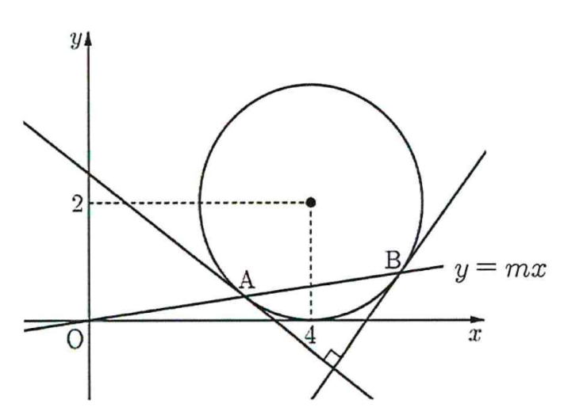

## Q
다음 그림과 같이 좌표평면에서 중심이 \((4,2)\)이고 반지름의 길이가 \(2\)인 원과 직선
\[
y=mx
\]
가 서로 다른 두 점 \(A\), \(B\)에서 만날 때, 두 점 \(A\), \(B\)에서 각각 원에 접하는 두 직선이 서로 수직이 되도록 하는 모든 \(m\)의 값의 합을 구하시오.

## Choices

## Answer
\[
\frac{8}{7}
\]

## Solution
원의 중심을 \(C(4,2)\)라 하자.

점 \(A\), \(B\)에서 그은 두 접선이 서로 수직이면, 반지름 \(CA\), \(CB\)도 서로 수직이다.

따라서 삼각형 \(ACB\)는
\[
CA=CB=2,\qquad \angle ACB=90^\circ
\]
인 직각이등변삼각형이다.

선분 \(AB\)의 중점을 \(M\)이라 하면, 직각이등변삼각형에서
\[
AB=2\sqrt{2}
\]
이므로
\[
AM=\sqrt{2}
\]
이다.

또 중심에서 현에 내린 수선은 그 현을 이등분하므로 \(CM\perp AB\)이다.

직각삼각형 \(CMA\)에서
\[
CM=\sqrt{CA^2-AM^2}
=\sqrt{2^2-(\sqrt{2})^2}
=\sqrt{2}
\]
이다.

즉, 중심 \(C(4,2)\)에서 직선
\[
y=mx
\]
까지의 거리는
\[
\sqrt{2}
\]
이다.

직선 \(y=mx\)를
\[
mx-y=0
\]
으로 놓으면
\[
\frac{|4m-2|}{\sqrt{m^2+1}}=\sqrt{2}
\]
이다.

양변을 제곱하면
\[
(4m-2)^2=2(m^2+1)
\]
\[
16m^2-16m+4=2m^2+2
\]
\[
7m^2-8m+1=0
\]
이다.

따라서
\[
m=\frac{8\pm 6}{14}
\]
이므로
\[
m=1,\ \frac{1}{7}
\]
이다.

그러므로 모든 \(m\)의 값의 합은
\[
1+\frac{1}{7}=\frac{8}{7}
\]
이다.

