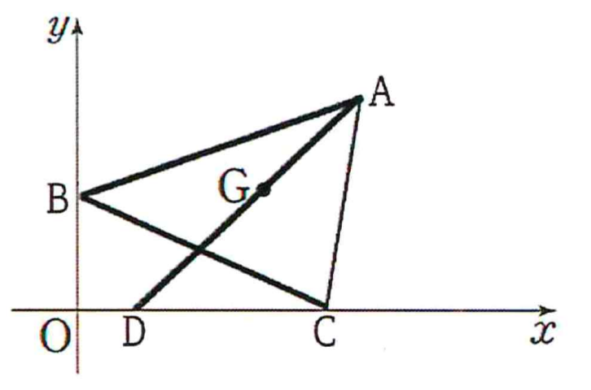

## Q
다음 그림과 같이 좌표평면에서 세 점 \(A(p,q)\), \(B(0,2)\), \(C(4,0)\)과 삼각형 \(ABC\)의 무게중심 \(G\)에 대하여 선분 \(AG\)의 연장선이 \(x\)축과 만나는 점을 \(D(1,0)\)라고 하자. 선분 \(AG\)의 길이가 \(2\sqrt{2}\)일 때, 점 \(A\)의 좌표를 구하시오.

\[
\text{(단, 점 \(A\)는 제1사분면 위의 점이다.)}
\]

## Choices

## Answer
\[
(5,4)
\]

## Solution
선분 \(BC\)의 중점을 \(M\)이라 하면
\[
M=\left(\frac{0+4}{2},\frac{2+0}{2}\right)=(2,1)
\]
이다.

삼각형의 무게중심 \(G\)는 중선 \(AM\) 위에 있으므로
\[
A,\ G,\ M
\]
은 한 직선 위에 있다.

또 선분 \(AG\)의 연장선이 \(x\)축과 만나는 점이 \(D(1,0)\)이므로
\[
A,\ G,\ D
\]
도 한 직선 위에 있다.

따라서
\[
A,\ M,\ D
\]
는 한 직선 위에 있다.

점 \(M(2,1)\), \(D(1,0)\)를 지나는 직선의 방정식은
\[
y=x-1
\]
이므로 점 \(A(p,q)\)는
\[
q=p-1
\]
을 만족한다.

또 무게중심은 중선을
\[
AG:GM=2:1
\]
로 나누므로
\[
AM=\frac{3}{2}AG=\frac{3}{2}\cdot 2\sqrt{2}=3\sqrt{2}
\]
이다.

점 \(A\)가 직선 \(y=x-1\) 위에 있으므로
\[
A=(p,p-1)
\]
로 둘 수 있다.

그러면
\[
AM=\sqrt{(p-2)^2+\{(p-1)-1\}^2}
\]
\[
=\sqrt{(p-2)^2+(p-2)^2}
=\sqrt{2}(p-2)
\]
이다.

\[
\sqrt{2}(p-2)=3\sqrt{2}
\]
이므로
\[
p=5
\]
이다.

따라서
\[
q=p-1=4
\]
이므로 점 \(A\)의 좌표는
\[
(5,4)
\]
이다.

