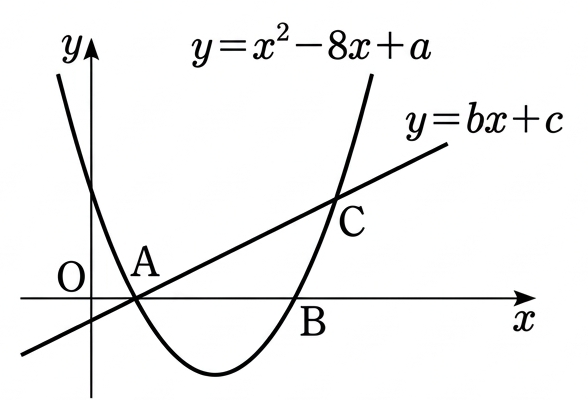

## Q
그림과 같이 이차함수 \(y=x^2-8x+a\)의 그래프는 \(x\)축과 서로 다른 두 점 \(A,\ B\)에서 만나고,
기울기가 양수인 직선 \(y=bx+c\)와 서로 다른 두 점 \(A,\ C\)에서 만난다.
\(\overline{AB}=6\)이고 삼각형 \(ABC\)의 넓이가 \(21\)일 때, \(abc\)의 값은?
(단, \(a,\ b,\ c\)는 상수이고 점 \(A\)의 \(x\)좌표는 점 \(B\)의 \(x\)좌표보다 작다.)

## Choices
① -28
② -21
③ -14
④ -7
⑤ \(-\frac{7}{2}\)

## Answer
④

## Solution
이차함수의 두 근을 \(r_1,\ r_2\)라 하면
\[
r_1+r_2=8,\quad r_2-r_1=6
\]
이다.
따라서
\[
r_1=1,\quad r_2=7.
\]
즉
\[
A=(1,0),\ B=(7,0),\ a=r_1r_2=7.
\]

직선 \(y=bx+c\)가 \(A(1,0)\)를 지나므로
\[
0=b\cdot 1+c\Rightarrow c=-b.
\]
따라서 직선은
\[
y=b(x-1).
\]

점 \(C\)의 \(x\)좌표를 \(t\)라 하면
\[
t^2-8t+7=b(t-1)
\]
이고, 한 근이 \(t=1\)이므로 다른 근은 \(t=7+b\)이다.
그러므로
\[
y_C=b(t-1)=b(6+b).
\]

삼각형 \(ABC\)의 밑변 길이는 \(\overline{AB}=6\), 높이는 \(y_C\)이므로
\[
\frac12\cdot 6\cdot y_C=21
\Rightarrow y_C=7.
\]
따라서
\[
b(6+b)=7
\Rightarrow b^2+6b-7=0
\Rightarrow b=1\ \text{또는}\ -7.
\]
기울기가 양수이므로 \(b=1\), 따라서 \(c=-1\).

\[
abc=7\cdot 1\cdot(-1)=-7.
\]
정답은 ④이다.
