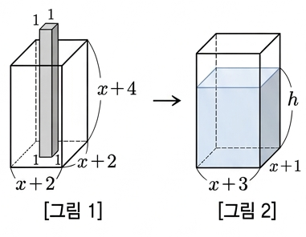

## Q
오른쪽 [그림 1]과 같이 물이 가득 담긴 직육면체 모양의 그릇에
직육면체 모양의 막대를 밑면과 맞닿게 수직으로 넣었다.
이때 남아 있는 물을 [그림 2]와 같은 직육면체 모양의 그릇에 옮겨 담았을 때,
수면의 높이 \(h\)를 구하는 풀이 과정을 쓰고 답을 구하시오.
(단, 막대의 길이는 \(x+4\)보다 길다.)

(1) [그림 1]과 같이 물이 가득 담긴 직육면체 모양의 그릇의 물의 부피를 구하시오.

(2) [그림 1]과 같이 물이 가득 담긴 직육면체 모양의 그릇에 직육면체 모양의 막대를 밑면과 맞닿게 수직으로 넣었을 때
남아있는 물의 부피를 구하시오.

(3) [그림 2]와 같은 직육면체 모양의 그릇으로 남아있는 물을 옮겨 담았을 때, 수면의 높이 \(h\)를 구하시오.

## Choices

## Answer
(1) \((x+2)^2(x+4)\), (2) \((x+1)(x+3)(x+4)\), (3) \(h=x+4\)

## Solution
[그림 1]에서 물이 가득 찬 그릇의 가로, 세로, 높이는 각각 \(x+2,\ x+2,\ x+4\)이므로

\[
\text{(1) 물의 부피}= (x+2)(x+2)(x+4)=(x+2)^2(x+4).
\]

막대의 밑면은 \(1\times1\), 길이는 \(x+4\)보다 길어서 그릇의 바닥부터 윗면까지를 모두 차지한다.
따라서 물이 차지할 수 없는 막대 부분의 부피는
\[
1\cdot1\cdot(x+4)=x+4.
\]
그러므로 남아 있는 물의 부피는
\[
\text{(2) 남은 물의 부피}
=(x+2)^2(x+4)-(x+4)
=(x+4)\{(x+2)^2-1\}
=(x+4)(x+1)(x+3).
\]

[그림 2] 그릇의 밑면은 \((x+3)\times(x+1)\)이고 수면 높이가 \(h\)이므로
\[
(x+3)(x+1)h=(x+4)(x+1)(x+3).
\]
따라서
\[
\text{(3) }h=x+4.
\]
