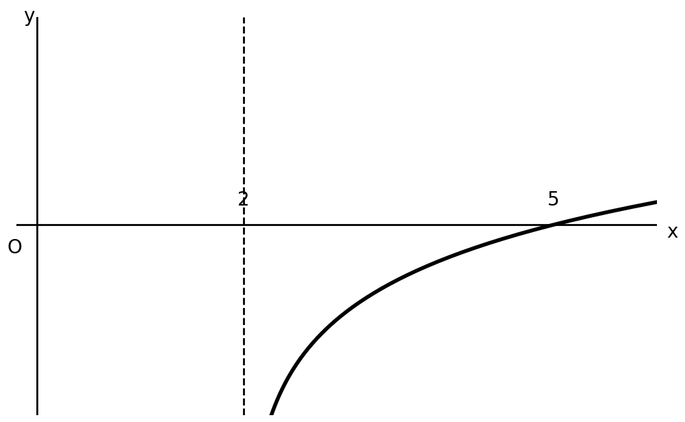

## Q
함수
$$
y=\log_3 (x-a)+b
$$
의 그래프가 아래의 그림과 같을 때, $ab$의 값은?
(단, $a,\ b$는 상수이고 직선 $x=2$는 점근선이다.)

## Choices
① $-3$
② $-2$
③ $-1$
④ $1$
⑤ $2$

## Answer
②

## Solution
점근선이 $x=2$이므로
$$
x-a=0
$$
에서 점근선이 생긴다. 따라서
$$
a=2
$$
이다.

또 그래프가 $x$축과 만나는 점의 $x$좌표가 $5$이므로
$$
0=\log_3 (5-2)+b=\log_3 3+b=1+b
$$
이다. 따라서
$$
b=-1
$$
이다.

그러므로
$$
ab=2\times (-1)=-2
$$
이다.
