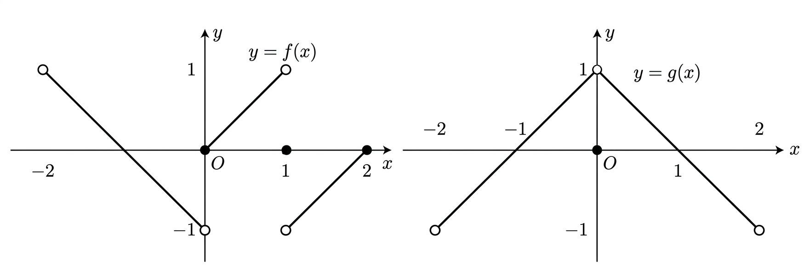

## Q
두 함수 $y=f(x)$, $y=g(x)$의 그래프가 다음과 같을 때,
$$
\lim_{x\to 0^-}f(x)+g(0)
$$
의 값은?

## Choices
① $-2$
② $-1$
③ $0$
④ $1$
⑤ $2$

## Answer
②

## Solution
그래프에서
$$
\lim_{x\to 0^-}f(x)=-1
$$
이고, $x=0$에서의 함수값은
$$
g(0)=0
$$
이다.

따라서
$$
\lim_{x\to 0^-}f(x)+g(0)=-1+0=-1
$$
이다.
