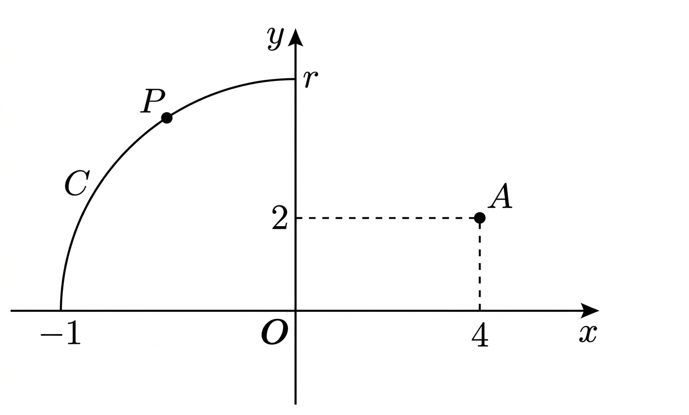

## Q
> 오류문항: 보기 중 정답이 없습니다. 실제 값은 $2\sqrt{5}$입니다.

다음 그림과 같이 $r>2$에 대하여, 좌표평면 위에 사분원의 호
$$
C:x^2+y^2=r^2 \quad (x\le 0,\ y\ge 0)
$$
과 점 $A(4,2)$가 있다. 점 $A$를 원점에 대하여 대칭이동한 점인 $A'$과, $C$를 움직이는 점 $P$에 대하여 삼각형 $AA'P$의 넓이의 최댓값을 $n(r)$이라 할 때,
$$
\lim_{r\to\infty}\frac{n(r)}{r}
$$
의 값은?

## Choices
① $\dfrac{1}{\sqrt{5}}$
② $1$
③ $2$
④ $\sqrt{5}$
⑤ $3$

## Answer
오류문항(보기에 없음)

## Solution
점 $P$를
$$
P(x,y)
$$
라 하자. 그러면 $x\le 0$, $y\ge 0$, $x^2+y^2=r^2$이다.

좌표를 이용한 삼각형의 넓이 공식으로 삼각형 $AA'P$의 넓이 $S$를 구하면
$$
S=\frac12\left|4(-2-y)+(-4)(y-2)+x\{2-(-2)\}\right|
$$
이다.

정리하면
$$
S=2|x-2y|
$$
이고, $x\le 0$, $y\ge 0$이므로
$$
S=2(2y-x)
$$
이다.

또
$$
(2y-x)^2=5(x^2+y^2)-(2x+y)^2
$$
이므로
$$
(2y-x)^2\le 5r^2
$$
이다.

따라서
$$
2y-x\le \sqrt{5}\,r
$$
이고, 최댓값은
$$
\sqrt{5}\,r
$$
이다.

그러므로
$$
n(r)=2\sqrt{5}\,r
$$
이고,
$$
\lim_{r\to\infty}\frac{n(r)}{r}=2\sqrt{5}
$$
이다.

즉, 원래 보기에는 정답이 없다.
