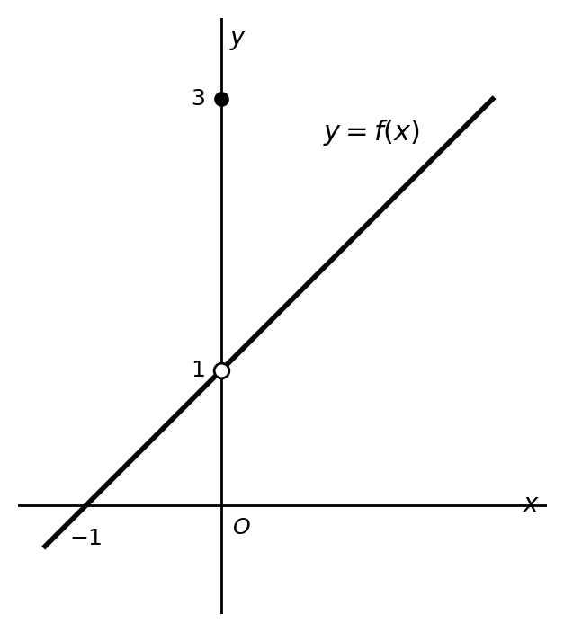

## Q
함수 $f(x)$의 그래프가 다음과 같을 때, $x=0$에서의 극한값
$$
\lim_{x\to 0}f(x)
$$
을 구하시오.

## Choices

## Answer
$1$

## Solution
그래프에서 $x=0$의 왼쪽과 오른쪽에서 모두 함수값이
$$
1
$$
에 가까워진다.

따라서
$$
\lim_{x\to 0}f(x)=1
$$
이다.
