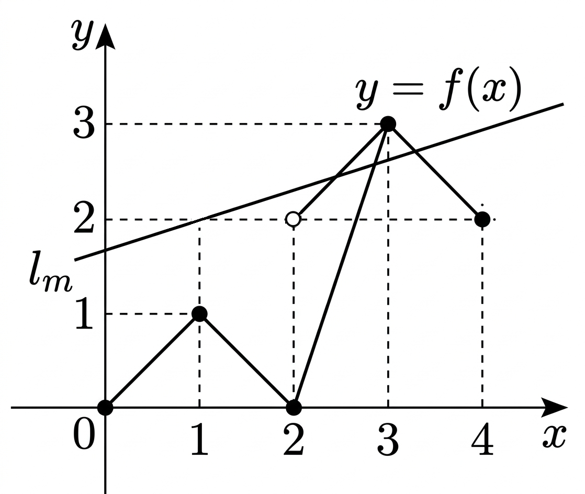

## Q
임의의 실수 $m$에 대하여 $\ell_m$은 점 $(1,2)$를 지나는 기울기 $m$인 직선이다. 닫힌구간 $[0,4]$에서 정의된 함수 $f(x)$의 그래프가 다음과 같을 때, 함수 $y=f(x)$와 직선 $\ell_m$이 만나는 점의 개수를 $g(m)$이라 하자. $m=\dfrac12$에서 함수 $g(m)$의 우극한과 좌극한을 각각 $a,b$라 할 때, $a,b,g(a),g(b)$의 값을 각각 순서대로 구하시오.

## Choices

## Answer
$0,\ 2,\ 1,\ 1$

## Solution
직선 $\ell_m$의 방정식은
$$
y=m(x-1)+2
$$
이다.

그래프의 위쪽 왼편 선분은
$$
y=x \quad (2<x\le 3)
$$
이므로, 이 선분과의 교점의 $x$좌표는
$$
x=m(x-1)+2
$$
에서
$$
x=\frac{2-m}{1-m}
$$
이다. 이 값이 $2<x\le 3$이 되려면
$$
0<m\le \frac12
$$
이어야 한다.

또 위쪽 오른편 선분은
$$
y=-x+6 \quad (3\le x\le 4)
$$
이므로, 이 선분과의 교점의 $x$좌표는
$$
-x+6=m(x-1)+2
$$
에서
$$
x=\frac{m+4}{m+1}
$$
이다. 이 값이 $3\le x\le 4$가 되려면
$$
0\le m\le \frac12
$$
이어야 한다.

따라서 $m<\dfrac12$에서 $\dfrac12$에 아주 가까우면 교점이 2개이고, $m>\dfrac12$에서 $\dfrac12$에 아주 가까우면 교점이 없다.
그러므로
$$
a=0,\qquad b=2
$$
이다.

이제
$$
g(0)
$$
을 구하면, 직선은 $y=2$가 되고 그래프와는 점 $(4,2)$에서만 만나므로
$$
g(0)=1
$$
이다.

또
$$
g(2)
$$
를 구하면, 직선은 $y=2x$가 되고 그래프와는 점 $(0,0)$에서만 만나므로
$$
g(2)=1
$$
이다.

따라서 구하는 값은
$$
0,\ 2,\ 1,\ 1
$$
이다.
