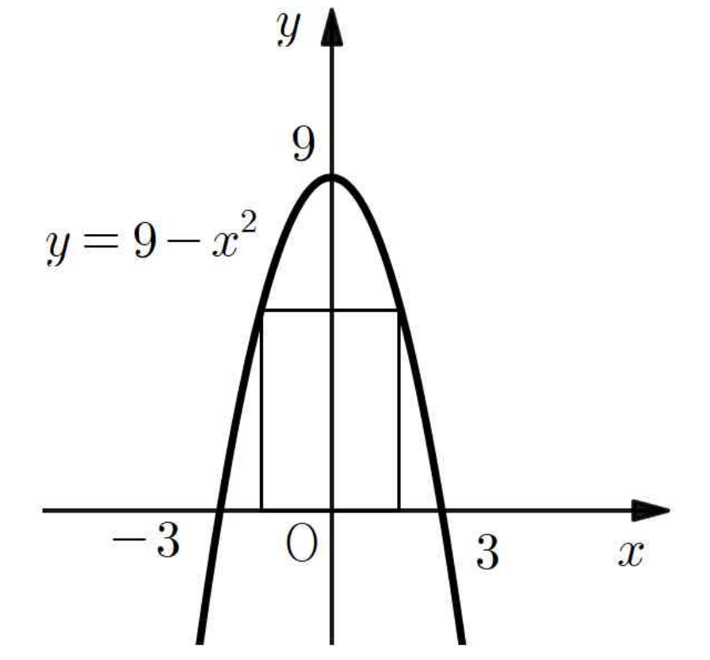

## Q
오른쪽 그림과 같은 이차함수 $y=9-x^2$의 그래프와 $x$축으로 둘러싸인 부분에 직사각형을 내접시킬 때, 이 직사각형의 둘레의 길이의 최댓값을 구하는 과정과 답을 쓰시오.

## Choices

## Answer
최댓값은 $20$이다.

## Solution
직사각형의 오른쪽 위 꼭짓점을 $(a,\ 9-a^2)$라 두면
\[
0\le a\le 3
\]
이고, 직사각형의 가로 길이와 세로 길이는 각각
\[
2a,\quad 9-a^2
\]
이다.

둘레의 길이를 $L$이라 하면
\[
L=2\{2a+(9-a^2)\}
=-2a^2+4a+18
\]
\[
L=-2(a-1)^2+20
\]

따라서 $a=1$일 때 $L$이 최대가 되고,
최댓값은
\[
20
\]
이다.
