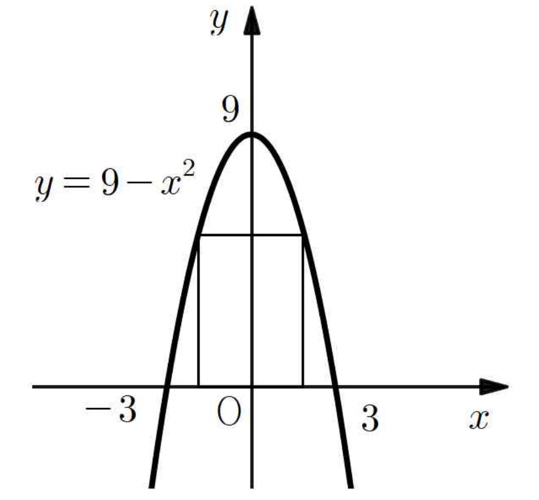

## Q
오른쪽 그림과 같이 두 꼭짓점이 \(x\)축 위에 있고, 나머지 두 꼭짓점이 이차함수 \(y=9-x^2\)의 그래프 위에 있는 직사각형이 있다.
이 직사각형의 둘레의 길이의 최댓값을 구하시오.

## Choices

## Answer
최댓값은 $20$이다.

## Solution
직사각형의 오른쪽 위 꼭짓점을 $(a,\ 9-a^2)$라 두면
\[
0\le a\le 3
\]
이고, 직사각형의 가로 길이와 세로 길이는 각각
\[
2a,\quad 9-a^2
\]
이다.

둘레의 길이를 $L$이라 하면
\[
L=2\{2a+(9-a^2)\}
=-2a^2+4a+18
\]
\[
L=-2(a-1)^2+20
\]

따라서 $a=1$일 때 $L$이 최대가 되고,
최댓값은
\[
20
\]
이다.

따라서 답은 최댓값은 $20$이다.이다.
