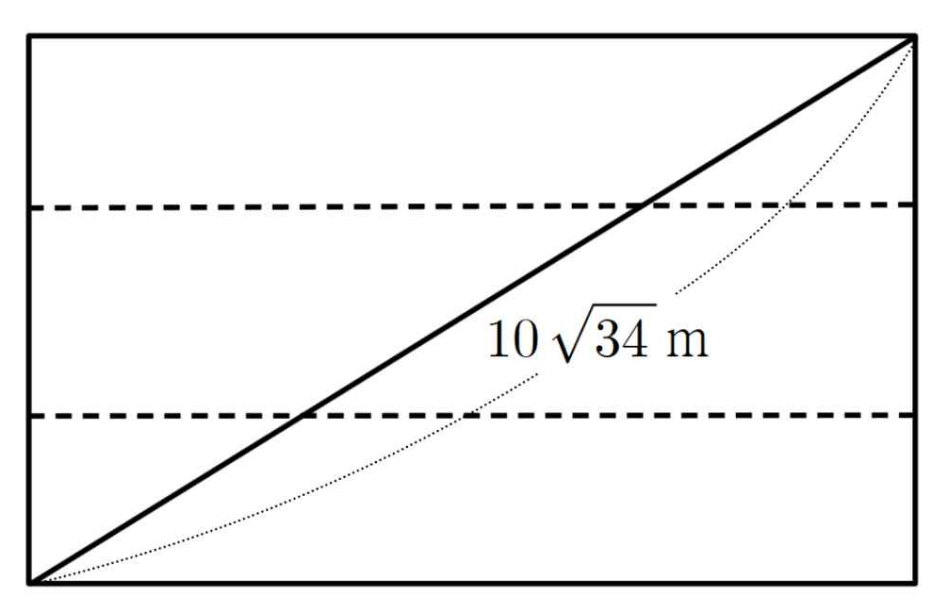

## Q
오른쪽 그림과 같이 넓이가 $1500\text{m}^2$인 직사각형 모양의 수영장이 있다. 이 수영장의 대각선의 길이가 $10\sqrt{34}\text{m}$일 때, 이 수영장의 가로, 세로의 길이를 구하는 과정과 답을 쓰시오. (단 가로의 길이가 세로의 길이보다 더 길다.)

## Choices

## Answer
가로 $50\text{m}$, 세로 $30\text{m}$

## Solution
가로를 $x\text{m}$, 세로를 $y\text{m}$라 두면 $(x>y>0)$
\[
xy=1500
\]
이고, 대각선 길이로부터
\[
x^2+y^2=(10\sqrt{34})^2=3400
\]

또
\[
(x-y)^2=x^2+y^2-2xy=3400-3000=400
\]
이므로
\[
x-y=20
\]
($x>y$이므로 양수 선택)

이제
\[
(x+y)^2=x^2+y^2+2xy=3400+3000=6400
\]
따라서
\[
x+y=80
\]

연립하면
\[
x=\frac{(x+y)+(x-y)}{2}=\frac{80+20}{2}=50
\]
\[
y=\frac{(x+y)-(x-y)}{2}=\frac{80-20}{2}=30
\]

따라서 수영장의 길이는
\[
\text{가로 }50\text{m},\ \text{세로 }30\text{m}
\]
이다.
