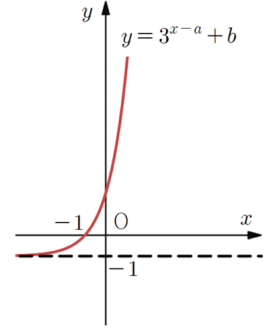

## Q
[그림 검수 필요] 함수 $y=3^{x-a}+b$의 그래프가 다음 그림과 같을 때, $ab$의 값을 구하시오. (단, $a$, $b$는 상수이고 직선 $y=-1$은 점근선이다.)

## Choices

## Answer
$1$

## Solution
점근선이 $y=-1$이므로 $b=-1$이다.
또 그래프의 표시를 따르면 점 $(0,2)$를 지나므로
$$
3^{-a}-1=2 \Rightarrow 3^{-a}=3 \Rightarrow a=-1
$$
이다.
$$
ab=(-1)(-1)=1
$$
