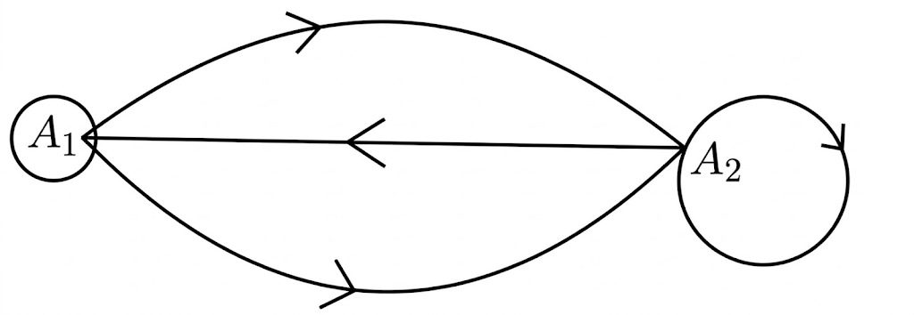

## Q
다음 그림은 두 지점 $A_1$, $A_2$를 연결하는 일방통행로를 화살표로 나타낸 것이다.

이때 $2\times2$행렬 $A$의 $(i,j)$성분 $a_{ij}$를
$$
a_{ij}=\text{(}A_i\text{ 지점에서 }A_j\text{ 지점으로 이동할 수 있는 일방통행로의 개수)}
$$
라 하자. 예를 들어 $a_{12}=2$이다. $2\times2$행렬 $E$, $X$, $O$에 대하여 등식
$$
AE-3A+X=O
$$
를 만족시키는 행렬 $X$를 구하여라. (단, $E$는 단위행렬, $O$는 영행렬)

## Choices
① $\begin{pmatrix}0 & 4 \\ 2 & 2\end{pmatrix}$
② $\begin{pmatrix}0 & 2 \\ 1 & 1\end{pmatrix}$
③ $\begin{pmatrix}0 & -2 \\ 1 & 1\end{pmatrix}$
④ $\begin{pmatrix}0 & -4 \\ -2 & -2\end{pmatrix}$
⑤ $\begin{pmatrix}0 & -4 \\ 2 & 2\end{pmatrix}$

## Answer
①

## Solution
그림에서 $a_{11}=0$, $a_{12}=2$, $a_{21}=1$, $a_{22}=1$이므로
$$
A=\begin{pmatrix}0 & 2 \\ 1 & 1\end{pmatrix}
$$
이다.

$E$는 단위행렬이므로 $AE=A$.
$$
AE-3A+X=O
\Rightarrow A-3A+X=O
\Rightarrow -2A+X=O
\Rightarrow X=2A
$$
따라서
$$
X=\begin{pmatrix}0 & 4 \\ 2 & 2\end{pmatrix}
$$
이다.
