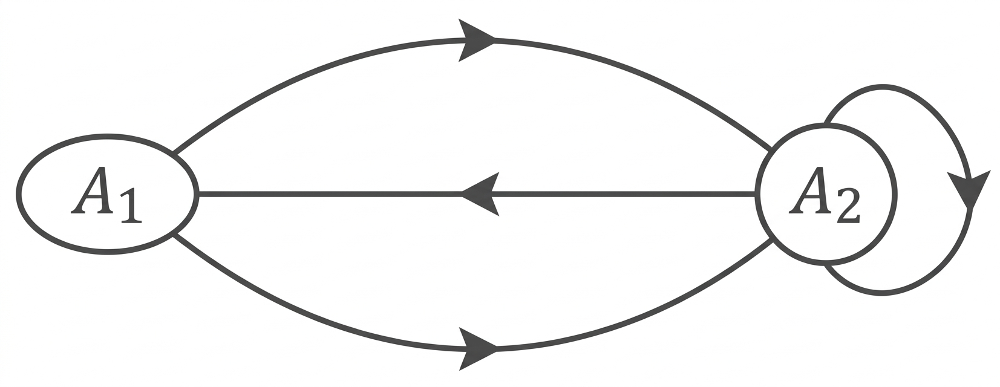

## Q
다음 그림은 두 지점 \(A_1,\ A_2\)를 연결하는 일방통행로를 화살표로 나타낸 것이다.

이때 \(2\times2\)행렬 \(A\)의 \((i,j)\)성분 \(a_{ij}\)를
\[
a_{ij}=\left(A_i\text{ 지점에서 }A_j\text{ 지점으로 이동할 수 있는 일방통행로의 개수}\right)
\]
라 하자. 예를 들어 \(a_{12}=2\)이다.
\(2\times2\)행렬 \(E,\ X,\ O\)에 대하여 등식 \(AE-3A+X=O\)를 만족시키는 행렬 \(X\)를 구하면?
(단, \(E\)는 단위행렬, \(O\)는 영행렬이다.)

## Choices
① \(\begin{pmatrix}0 & 4 \\ 2 & 2\end{pmatrix}\)
② \(\begin{pmatrix}0 & 2 \\ 1 & 1\end{pmatrix}\)
③ \(\begin{pmatrix}0 & -2 \\ 1 & 1\end{pmatrix}\)
④ \(\begin{pmatrix}0 & -4 \\ -2 & -2\end{pmatrix}\)
⑤ \(\begin{pmatrix}0 & -4 \\ 2 & 2\end{pmatrix}\)
## Answer
1

## Solution
From the diagram,
\[
A=
\begin{pmatrix}
0 & 2 \\
1 & 1
\end{pmatrix}.
\]
Since \(AE-3A+X=O\) and \(AE=A\),
\[
A-3A+X=O \Rightarrow X=2A.
\]
Thus
\[
X=
\begin{pmatrix}
0 & 4 \\
2 & 2
\end{pmatrix}.
\]
So the correct choice is 1.
