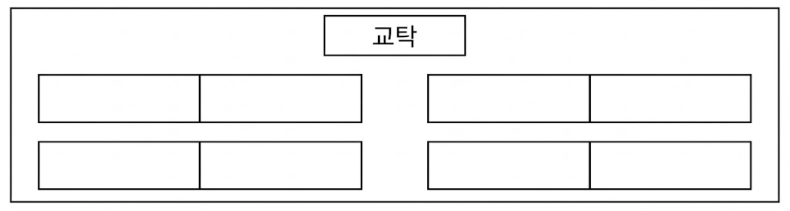

## Q
다음 아래 그림과 같이 1학년 3명과 2학년 3명이 자리에 앉아 공부를 하려고 한다.

1학년 1명과 2학년 1명이 짝을 지어 2명씩 같이 앉을 때, 6명이 모두 자리에 앉는 경우의 수를 구하여라. (단, 남은 자리는 비워 둔다.)

## Choices
① 192
② 384
③ 576
④ 1152
⑤ 2304

## Answer
④

## Solution
두 명이 앉는 책상이 $4$개이므로 6명이 앉으면 책상 $1$개는 빈다.

1) 비는 책상 선택: $4$가지

2) 남은 3개 책상에 1학년 3명 배치: $3!$가지

3) 각 책상에서 1학년의 좌우 자리 선택: $2^3$가지

4) 각 책상의 남은 자리에 2학년 3명 배치: $3!$가지

따라서 경우의 수는
$$
4\times3!\times2^3\times3!=1152
$$
이다.
