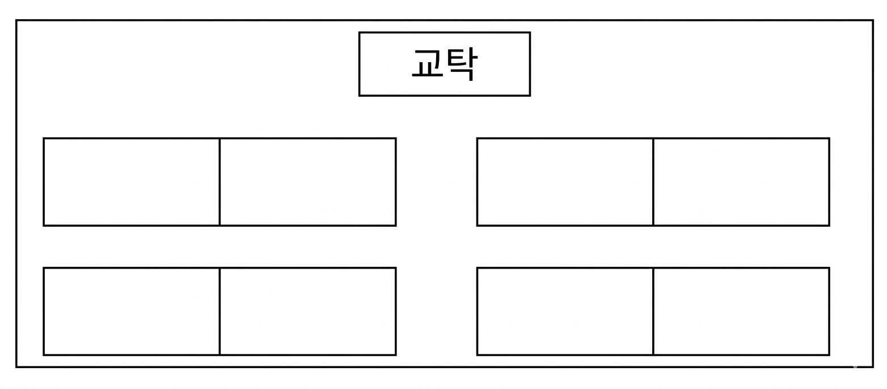

## Q
다음 그림과 같이 1학년 3명과 2학년 3명이 자리에 앉아 공부를 하려고 한다.
1학년 1명과 2학년 1명이 짝을 지어 2명씩 같이 앉을 때, 6명이 모두 자리에 앉는 경우의 수를 구하면?
(단, 남은 자리는 비워둔다.)

## Choices
① 192
② 384
③ 576
④ 1152
⑤ 2304
## Answer
4

## Solution
Match 3 first-year students with 3 second-year students:
\[
3! = 6
\]
ways.
Arrange the 3 pairs into 3 of the 4 two-seat blocks:
\[
{}_4P_3 = 4\times3\times2 = 24
\]
ways.
Each pair can switch left/right seats:
\[
2^3 = 8.
\]
Hence the total number of seatings is
\[
6\times24\times8 = 1152.
\]
So the correct choice is 4.
