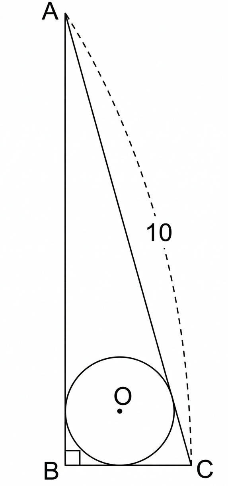

## Q
다음 아래 그림과 같이 $\angle B=90^\circ$인 직각삼각형 $ABC$의 빗변의 길이는 $10$이고 내접원의 반지름의 길이는 $1$일 때, $BC$의 길이는 $p-\sqrt{q}$이다. 이때 두 자연수 $p$, $q$에 대하여 $p+q$의 값은? (단, $BC<AB$)

## Choices
① 16
② 17
③ 18
④ 19
⑤ 20

## Answer
⑤

## Solution
$AB=a$, $BC=b$ ($a>b$), 빗변의 길이를 $10$이라 두자.

직각삼각형 내접반지름은
$$
r=\frac{a+b-10}{2}=1
$$
이므로
$$
a+b=12
$$
이다.

또
$$
a^2+b^2=100
$$
이다.

$(a+b)^2=a^2+b^2+2ab$에서
$$
144=100+2ab
$$
이므로
$$
ab=22
$$
이다.

따라서 $a,b$는
$$
t^2-12t+22=0
$$
의 두 근이므로
$$
t=6\pm\sqrt{14}
$$
이다.

$BC<AB$이므로
$$
BC=6-\sqrt{14}
$$
이다.

따라서
$$
p=6,\quad q=14,\quad p+q=20
$$
이다.
