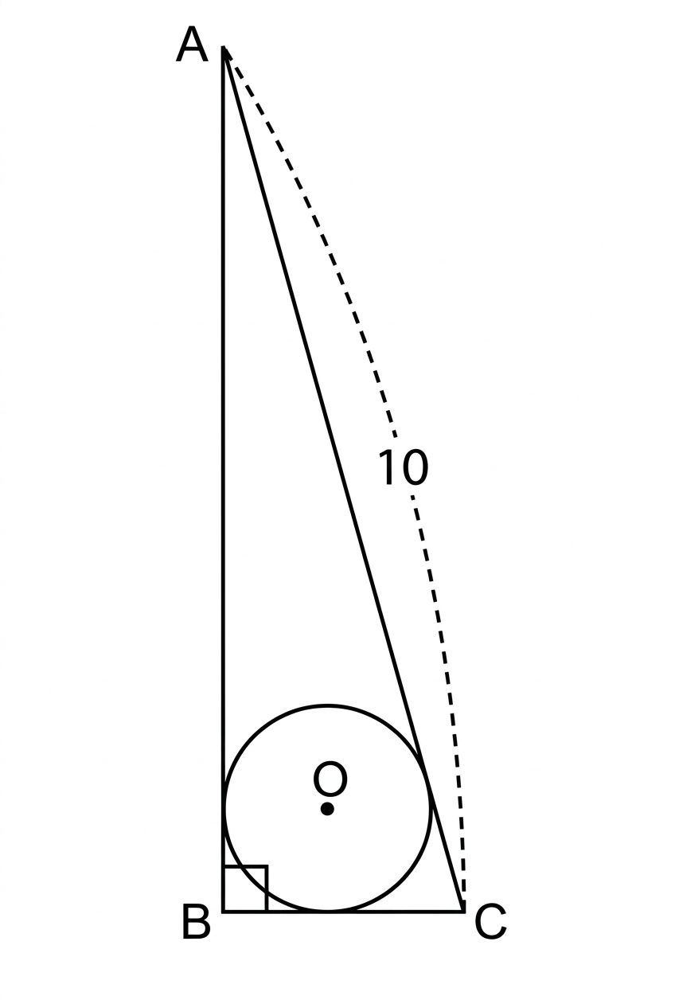

## Q
다음 그림과 같이 \(\angle B=90^\circ\)인 직각삼각형 \(ABC\)의 빗변의 길이는 10이고
내접원의 반지름의 길이는 1일 때, \(\overline{BC}\)의 길이는 \(p-\sqrt{q}\)이다.
이때 두 자연수 \(p,\ q\)에 대하여 \(p+q\)의 값은? (단, \(\overline{BC}<\overline{AB}\))

## Choices
① 16
② 17
③ 18
④ 19
⑤ 20
## Answer
5

## Solution
Let \(AB=x\), \(BC=y\). The hypotenuse is 10.
For a right triangle, the inradius is
\[
r=\frac{x+y-10}{2}.
\]
Since \(r=1\),
\[
x+y=12.
\]
Also,
\[
x^2+y^2=100.
\]
So
\[
(x+y)^2=x^2+y^2+2xy
\Rightarrow 144=100+2xy
\Rightarrow xy=22.
\]
Thus \(x,y\) are the roots of
\[
t^2-12t+22=0,
\]
so
\[
t=6\pm\sqrt{14}.
\]
Because \(BC<AB\),
\[
BC=6-\sqrt{14}.
\]
Hence \(p=6\), \(q=14\), and
\[
p+q=20.
\]
So the correct choice is 5.
