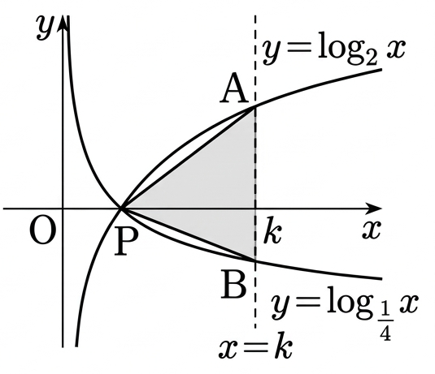

## Q
오른쪽 그림과 같이 두 곡선
$$
y=\log_2 x,\qquad y=\log_{\frac{1}{4}}x
$$
가 만나는 점을 $P$, 직선 $x=k\ (k>1)$가 두 곡선과 만나는 점을 각각 $A$, $B$라 하자. $\triangle PAB$의 넓이가 $45$일 때, 정수 $k$의 값은?

## Choices
① $14$  
② $15$  
③ $16$  
④ $17$  
⑤ $18$

## Answer
③

## Solution
두 곡선의 교점은
$$
\log_2 x=\log_{\frac{1}{4}}x
$$
에서 $x=1$이므로
$$
P=(1,0)
$$
이다.

또
$$
A=(k,\log_2k),\qquad B=(k,\log_{\frac14}k)
$$
이고
$$
\log_{\frac14}k=\frac{\log_2k}{\log_2\frac14}
=-\frac12\log_2k
$$
이므로
$$
AB=\log_2k-\log_{\frac14}k
=\frac32\log_2k
$$
이다.

밑변을 $AB$로 보면 높이는 점 $P$에서 직선 $x=k$까지의 거리 $k-1$이므로
$$
\frac12\cdot AB\cdot(k-1)=45
$$
$$
\frac12\cdot\frac32\log_2k\cdot(k-1)=45
$$
$$
(k-1)\log_2k=60
$$

선지의 정수값을 대입하면
$$
k=16\Rightarrow (16-1)\log_216=15\cdot4=60
$$
이 성립하므로
$$
k=16
$$
이다.
