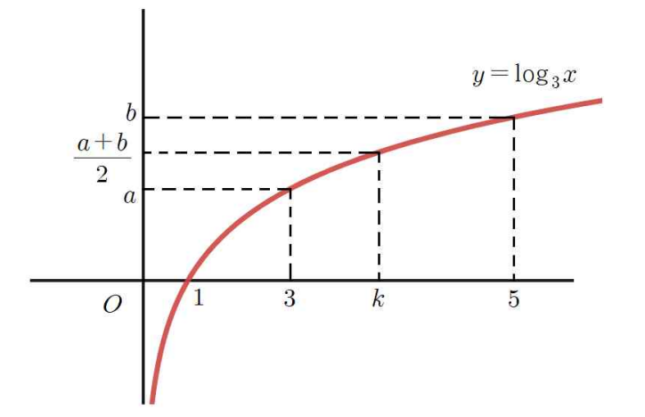

## Q
다음 그림과 같이 두 점 $(3,a)$, $(5,b)$는 함수 $y=\log_3 x$의 그래프 위의 점이다. 함수 $y=\log_3 x$의 그래프가 점 $\left(k,\dfrac{a+b}{2}\right)$를 지날 때, $k$의 값을 구하면?

## Choices
① $\sqrt{14}$
② $\sqrt{15}$
③ $4$
④ $\sqrt{17}$
⑤ $3\sqrt{2}$

## Answer
②

## Solution
$(3,a)$, $(5,b)$가 $y=\log_3 x$ 위의 점이므로
\[
a=\log_3 3=1,\qquad b=\log_3 5
\]
이다.

또
\[
\log_3 k=\frac{a+b}{2}
=\frac{1+\log_3 5}{2}
=\frac{\log_3 15}{2}
=\log_3 \sqrt{15}
\]
이므로
\[
k=\sqrt{15}
\]
이다.
