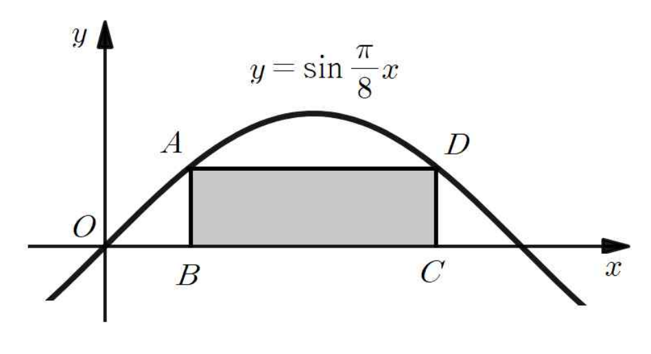

## Q
다음 그림과 같이 함수 $y=\sin\dfrac{\pi}{8}x$의 그래프와 $x$축으로 둘러싸인 부분에 직사각형 $ABCD$가 내접하고 있다. $\overline{BC}=4$일 때, 직사각형 $ABCD$의 넓이는?

## Choices
① $2$
② $2\sqrt{2}$
③ $3$
④ $4\sqrt{2}$
⑤ $5\sqrt{2}$

## Answer
②

## Solution
직사각형의 왼쪽 아래 꼭짓점의 $x$좌표를 $t$라 하면 오른쪽 아래 꼭짓점의 $x$좌표는 $t+4$이다.

윗변의 양 끝점이 그래프 위에 있으므로
\[
\sin\frac{\pi t}{8}=\sin\frac{\pi(t+4)}{8}
\]
이다.

$0\le t\le 4$에서 두 각은 서로 보각이므로
\[
\frac{\pi(t+4)}{8}=\pi-\frac{\pi t}{8}
\]
이고,
\[
t=2
\]
이다.

따라서 직사각형의 높이는
\[
\sin\frac{\pi}{4}=\frac{\sqrt{2}}{2}
\]
이므로 넓이는
\[
4\cdot \frac{\sqrt{2}}{2}=2\sqrt{2}
\]
이다.
