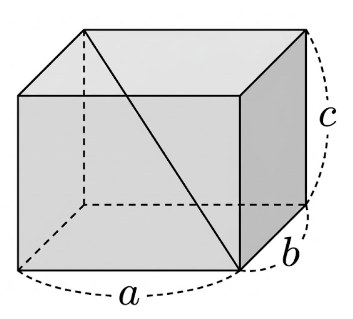

## Q
오른쪽 그림과 같이 세 모서리의 길이가 각각 \(a,\ b,\ c\)인 직육면체의 겉넓이가 \(52\)이고, 대각선의 길이가 \(\sqrt{29}\)일 때, 모든 모서리의 길이의 합은?

## Choices
① 9
② 18
③ 27
④ 36
⑤ 45

## Answer
④

## Solution
직육면체의 변의 길이를 \(a,b,c\)라 하면
\[
2(ab+bc+ca)=52 \Rightarrow ab+bc+ca=26
\]
이고 대각선 조건에서
\[
a^2+b^2+c^2=29.
\]
따라서
\[
(a+b+c)^2=a^2+b^2+c^2+2(ab+bc+ca)=29+52=81
\]
이므로 \(a+b+c=9\). 모든 모서리의 길이의 합은
\[
4(a+b+c)=36.
\]
정답은 \(④\)이다.
