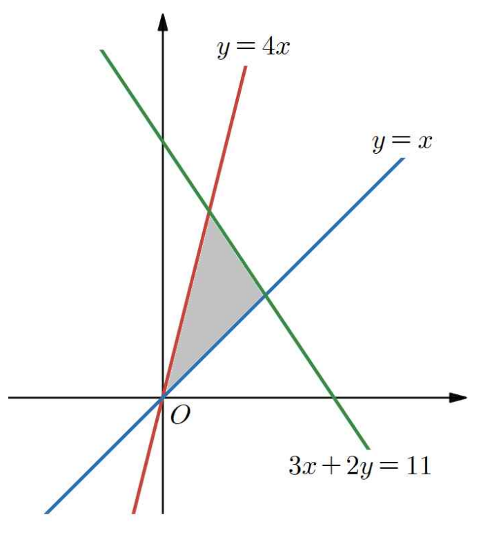

## Q
오른쪽 그림과 같이 세 직선
\[
y=x,\qquad y=4x,\qquad 3x+2y=11
\]
로 둘러싸인 삼각형의 넓이를 $S$라 할 때, $10S$의 값은?

## Choices
① $29$
② $30$
③ $31$
④ $32$
⑤ $33$

## Answer
⑤

## Solution
세 직선의 교점을 구하면 된다.

직선
\[
y=4x
\]
와
\[
3x+2y=11
\]
의 교점은
\[
3x+8x=11
\]
이므로
\[
(1,4)
\]
이다.

직선
\[
y=x
\]
와
\[
3x+2y=11
\]
의 교점은
\[
5x=11
\]
이므로
\[
\left(\frac{11}{5},\frac{11}{5}\right)
\]
이다.

또 직선
\[
y=x,\qquad y=4x
\]
의 교점은 원점이다.

따라서 삼각형의 세 꼭짓점은
\[
(0,0),\ (1,4),\ \left(\frac{11}{5},\frac{11}{5}\right)
\]
이다.

넓이 $S$는
\[
S=\frac{1}{2}\left|1\cdot \frac{11}{5}-4\cdot \frac{11}{5}\right|
\]
\[
=\frac{1}{2}\cdot \frac{33}{5}
\]
\[
=\frac{33}{10}
\]
이다.

따라서
\[
10S=33
\]
이므로 정답은 ⑤이다.
