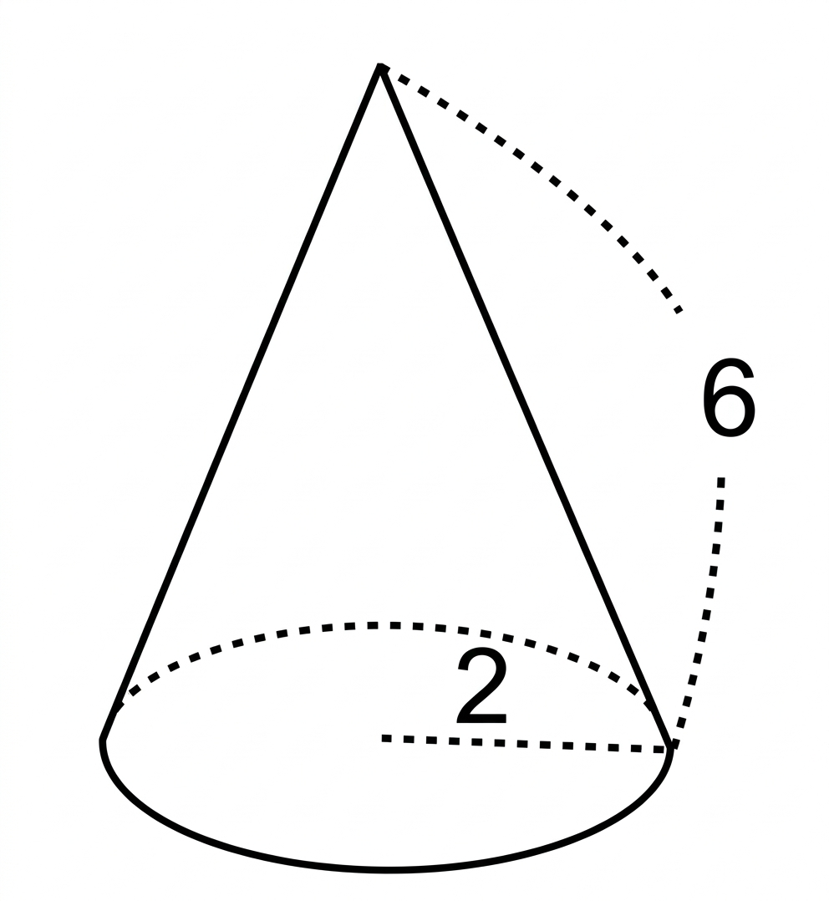

## Q
오른쪽 그림과 같이 밑면의 반지름의 길이가 $2$, 모선의 길이가 $6$인 원뿔의 겉넓이는?

## Choices
① $13\pi$
② $14\pi$
③ $15\pi$
④ $16\pi$
⑤ $17\pi$

## Answer
④

## Solution
원뿔의 겉넓이는 밑면의 넓이와 옆넓이의 합이므로
$$
\pi r^2+\pi rl=\pi\cdot 2^2+\pi\cdot 2\cdot 6=4\pi+12\pi=16\pi
$$
