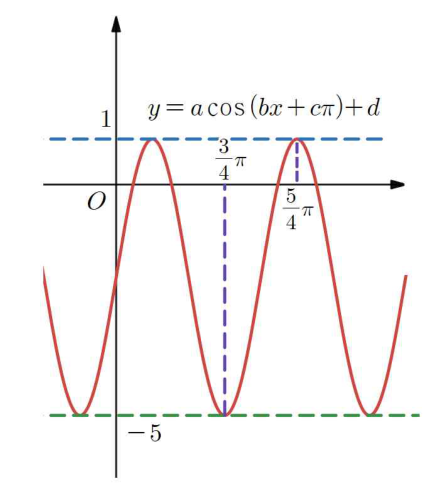

## Q
함수 $y=a\cos(bx+c\pi)+d$의 그래프가 다음 그림과 같을 때, 상수 $a$, $b$, $c$, $d$에 대하여 $\dfrac{ab}{cd}$의 값은? (단, $a>0$, $b>0$, $-1<c<0$)

## Choices
① -6
② -3
③ 1
④ 3
⑤ 6

## Answer
⑤

## Solution
원본 정답지의 그래프 판독값은 $a=3$, $b=2$, $c=-\dfrac12$, $d=-2$이다.
$$
\frac{ab}{cd}=\frac{3\cdot 2}{\left(-\frac12\right)(-2)}=6
$$
