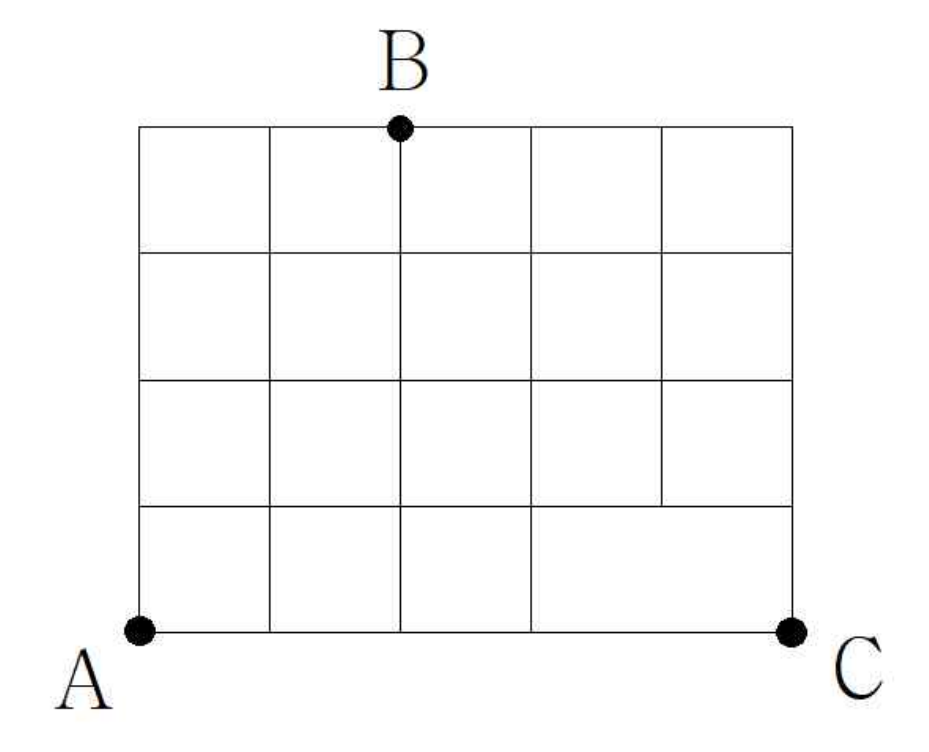

## Q
다음 그림과 같은 도로망이 있다. $A$지점에서 출발하여 $B$지점을 지나 $C$지점에 도착하는 최단 경로의 수를 구하시오. (단, 한 번 지나온 길은 다시 돌아가지 않는다.)

## Choices

## Answer
235

## Solution
$A$에서 $B$까지 가는 경우의 수는 15가지이다.
이를 두 경우로 나누어 센다.
1. $B$를 지나는 세로선의 일부를 이미 지나온 경우: 10가지
이때마다 $B$에서 $C$까지는 11가지
2. 위 경우가 아닌 경우: 5가지
이때마다 $B$에서 $C$까지는 25가지
따라서 전체 경우의 수는
$$
10\times 11+5\times 25=235
$$
이다.
