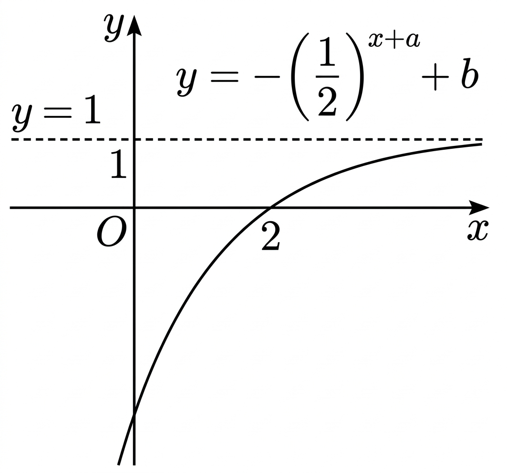

## Q
다음 그림은 함수
\[
y=-\left(\frac12\right)^{{x+a}}+b
\]
의 그래프이다. 상수 \(a,\ b\)에 대하여 \(a+b\)의 값은?

## Choices
① -3
② -1
③ 1
④ 3
⑤ 5

## Answer
②

## Solution
그래프의 수평점근선이 $y=1$이므로
$$b=1$$
이다.

또 그래프가 점 $(2,0)$을 지나므로
$$0=-\left(\dfrac12\right)^{2+a}+1$$
$$\left(\dfrac12\right)^{2+a}=1$$
따라서
$$2+a=0\Rightarrow a=-2$$
이다.

그러므로
$$a+b=-2+1=-1$$
이고 정답은 ②이다.

따라서 정답은 ②이다.
그래프의 수평점근선이 $y=1$이므로
$$b=1$$
이다.
또 그래프가 점 $(2,0)$을 지나므로
$$0=-\left(\dfrac12\right)^{2+a}+1$$
$$\left(\dfrac12\right)^{2+a}=1$$
따라서
$$2+a=0\Rightarrow a=-2$$
이다.
그러므로
$$a+b=-2+1=-1$$
이고 정답은 ②이다.

따라서 정답은 ②이다.
