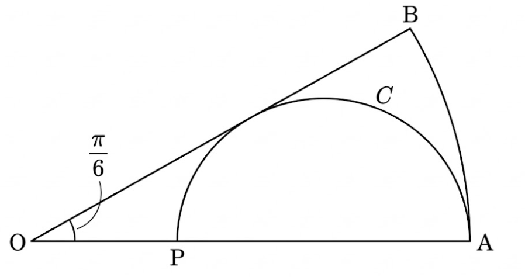

## Q
다음 그림과 같이 중심각의 크기가 $\frac{\pi}{6}$인 부채꼴 $\mathrm{OAB}$가 있다. 선분 $\mathrm{OA}$ 위의 점 $\mathrm{P}$에 대하여 선분 $\mathrm{PA}$를 지름으로 하고 선분 $\mathrm{OB}$에 접하는 반원을 $C$라 할 때, 부채꼴 $\mathrm{OAB}$의 넓이를 $S_1$, 반원 $C$의 넓이를 $S_2$라 하자. $S_1 - S_2 = 16\pi$ 일 때, 부채꼴 $\mathrm{OAB}$의 호 $\mathrm{AB}$의 길이는?

## Choices
① $\frac{7}{2}\pi$
② $4\pi$
③ $\frac{9}{2}\pi$
④ $5\pi$
⑤ $\frac{11}{2}\pi$

## Answer
②

## Solution
반원 $C$의 중심을 $\mathrm{M}$, 반지름의 길이를 $r$이라 하고 부채꼴 $\mathrm{OAB}$의 반지름의 길이를 $R$이라 하자.
반원 $C$가 선분 $\mathrm{OB}$에 접하므로 점 $\mathrm{M}$에서 선분 $\mathrm{OB}$에 내린 수선의 발을 $\mathrm{H}$라 하면 $\overline{\mathrm{MH}} = r$이다.
선분 $\mathrm{PA}$는 반원 $C$의 지름이므로 점 $\mathrm{M}$은 선분 $\mathrm{PA}$의 중점이고 $\overline{\mathrm{OM}} = \overline{\mathrm{OA}} - \overline{\mathrm{MA}} = R - r$이다.
직각삼각형 $\mathrm{OMH}$에서 $\angle{\mathrm{MOH}} = \frac{\pi}{6}$이므로
$$\sin\left(\frac{\pi}{6}\right) = \frac{\overline{\mathrm{MH}}}{\overline{\mathrm{OM}}} = \frac{r}{R-r} = \frac{1}{2}$$
$$2r = R - r \implies R = 3r$$
부채꼴 $\mathrm{OAB}$의 넓이 $S_1$은
$$S_1 = \frac{1}{2} R^2 \times \frac{\pi}{6} = \frac{1}{2} (3r)^2 \times \frac{\pi}{6} = \frac{3}{4}\pi r^2$$
반원 $C$의 넓이 $S_2$는
$$S_2 = \frac{1}{2}\pi r^2$$
조건에서 $S_1 - S_2 = 16\pi$이므로
$$\frac{3}{4}\pi r^2 - \frac{1}{2}\pi r^2 = \frac{1}{4}\pi r^2 = 16\pi$$
$$r^2 = 64$$
$r > 0$이므로 $r = 8$이다.
따라서 부채꼴 $\mathrm{OAB}$의 반지름의 길이는 $R = 3 \times 8 = 24$이다.
그러므로 부채꼴 $\mathrm{OAB}$의 호 $\mathrm{AB}$의 길이는
$$R \times \frac{\pi}{6} = 24 \times \frac{\pi}{6} = 4\pi$$
이다.
