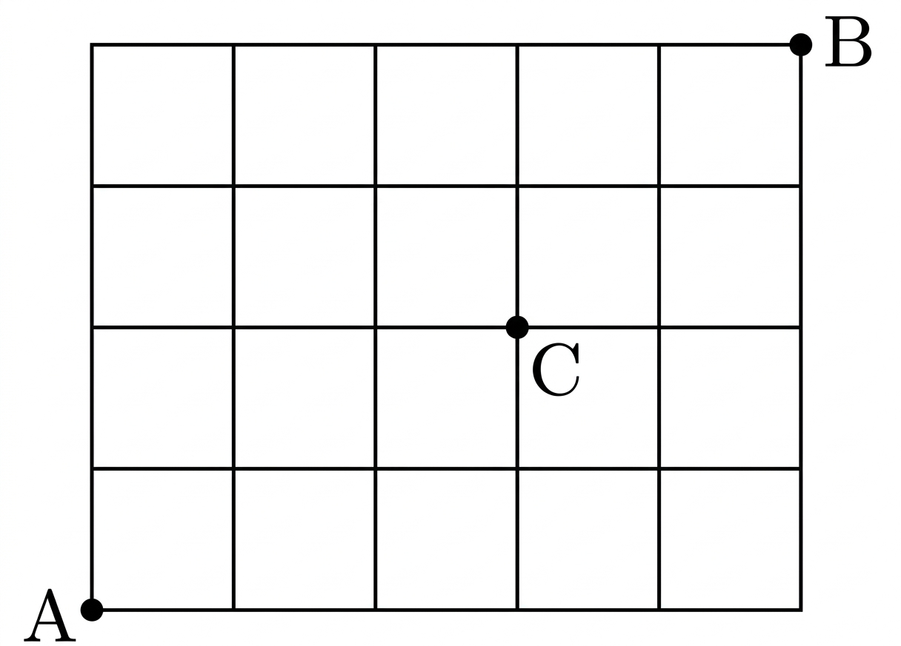

## Q
아래 그림과 같은 도로망에서 A 지점에서 C 지점을 거치지 않고 B 지점까지 최단 거리로 가는 경우의 수는?

## Choices
① 60
② 66
③ 72
④ 78
⑤ 84

## Answer
②

## Solution
그림에서 A에서 B까지 최단 거리로 가려면
오른쪽으로 5번, 위로 4번 이동하므로 전체 경우의 수는
$$
{}_{9}C_{4}=126
$$
이다.

C를 거치는 최단 경로 수를 구하면,
A에서 C까지는 오른쪽 3번, 위로 2번이므로
$$
{}_{5}C_{2}=10
$$
C에서 B까지는 오른쪽 2번, 위로 2번이므로
$$
{}_{4}C_{2}=6
$$
이다.

따라서 C를 거치지 않는 경우의 수는
$$
126-10\times 6=66
$$
이다.
