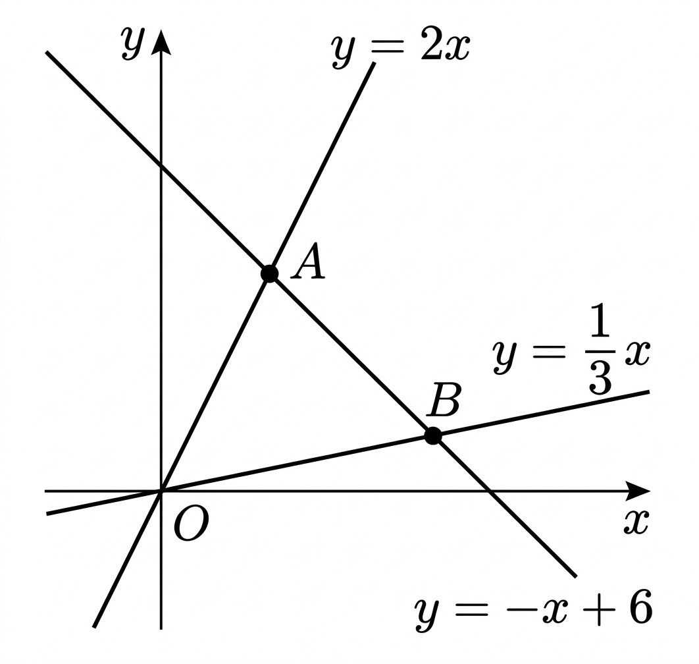

## Q
다음 그림과 같이 세 직선
\[
y=2x,\quad y=\frac{1}{5}x,\quad y=-x+6
\]
으로 둘러싸인 삼각형 \(AOB\)의 넓이를 구하시오.

## Choices
① \(3\)
② \(4\)
③ \(6\)
④ \(8\)
⑤ \(9\)

## Answer
⑤

## Solution
점 \(A\)는
\[
y=2x
\]
와
\[
y=-x+6
\]
의 교점이므로
\[
2x=-x+6
\]
에서
\[
x=2,\quad y=4
\]
이다.
따라서
\[
A(2,4)
\]
이다.

점 \(B\)는
\[
y=\frac{1}{5}x
\]
와
\[
y=-x+6
\]
의 교점이므로
\[
\frac{1}{5}x=-x+6
\]
에서
\[
6x=30,\quad x=5,\quad y=1
\]
이다.
따라서
\[
B(5,1)
\]
이다.

원점 \(O(0,0)\)와 두 점 \(A, B\)로 이루어진 삼각형의 넓이는
\[
\frac{1}{2}\left|2\cdot 1-4\cdot 5\right|
=\frac{1}{2}\cdot 18
=9
\]
이다.

따라서 정답은 ⑤이다.
