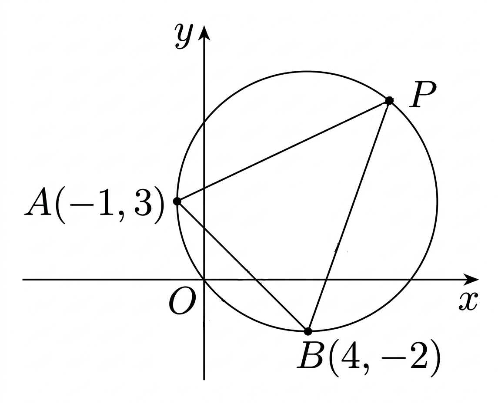

## Q
오른쪽 그림과 같이 원
\[
(x-4)^2+(y-3)^2=25
\]
위의 두 점 \(A(-1,3)\), \(B(4,-2)\)가 있다.
원 위의 한 점 \(P\)에 대하여 삼각형 \(PAB\)의 넓이가 최대가 될 때,
점 \(P\)와 원의 중심을 지나는 직선의 방정식을 구하시오.

## Choices
① \(y=x-1\)
② \(y=-x-1\)
③ \(y=\dfrac{1}{2}x-1\)
④ \(y=-2x-1\)
⑤ \(y=-\dfrac{1}{2}x-1\)

## Answer
①

## Solution
삼각형 \(PAB\)의 넓이는
\[
\frac{1}{2}\times AB\times \text{점 }P\text{에서 직선 }AB\text{까지의 거리}
\]
이다.

여기서 \(AB\)의 길이는 일정하므로, 넓이가 최대가 되려면 점 \(P\)에서 직선 \(AB\)까지의 거리가 최대가 되어야 한다.
원 위의 점에서 한 직선까지의 거리가 최대가 되는 점은 원의 중심을 지나면서 그 직선에 수직인 지름 위에 있다.

따라서 중심과 점 \(P\)를 지나는 직선은 직선 \(AB\)에 수직이다.

두 점 \(A(-1,3)\), \(B(4,-2)\)를 지나는 직선 \(AB\)의 기울기는
\[
\frac{-2-3}{4-(-1)}=-1
\]
이다.

그러므로 이에 수직인 직선의 기울기는
\[
1
\]
이다.

원의 중심은
\[
(4,3)
\]
이므로, 구하는 직선은
\[
y-3=1(x-4)
\]
이다.

따라서
\[
y=x-1
\]
이다.

따라서 정답은 ①이다.
