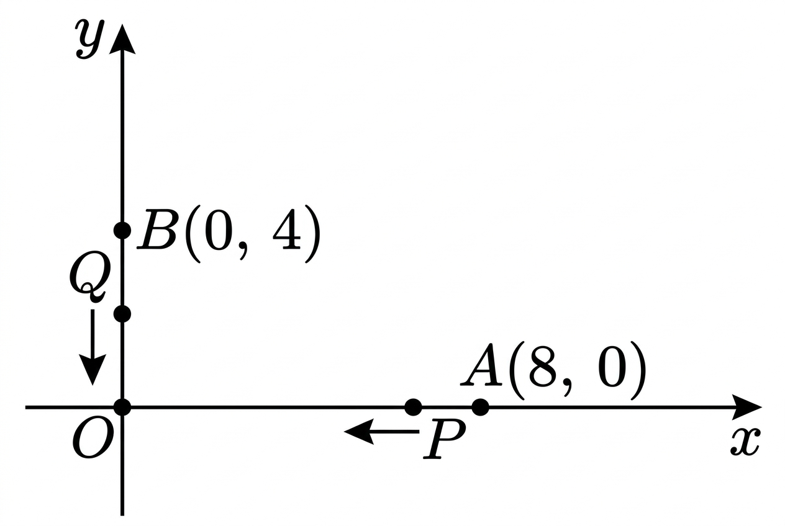

## Q
오른쪽 그림과 같이 점 \(P\)는 점 \(A(8,0)\)에서 매초 \(1\)의 속력으로 \(x\)축을 따라 왼쪽으로 움직이고,
점 \(Q\)는 점 \(B(0,4)\)에서 매초 \(3\)의 속력으로 \(y\)축을 따라 아래로 움직인다.
두 점 \(P, Q\)가 동시에 출발할 때, 두 점 \(P, Q\) 사이의 거리의 최솟값을 구하시오.

## Choices

## Answer
\(2\sqrt{10}\)

## Solution
출발 후 \(t\)초 뒤의 점의 좌표를 구하면
\[
P(8-t, 0),\quad Q(0, 4-3t)
\]
이다.

두 점 사이의 거리의 제곱을 \(D^2\)라 하면
\[
D^2=(8-t)^2+(4-3t)^2
\]
이다.

이를 정리하면
\[
D^2=t^2-16t+64+9t^2-24t+16
=10t^2-40t+80
\]
이고,
\[
D^2=10(t-2)^2+40
\]
이다.

따라서 \(D^2\)의 최솟값은 \(40\)이고, 거리 \(D\)의 최솟값은
\[
\sqrt{40}=2\sqrt{10}
\]
이다.

따라서 답은 \(2\sqrt{10}\)이다.
