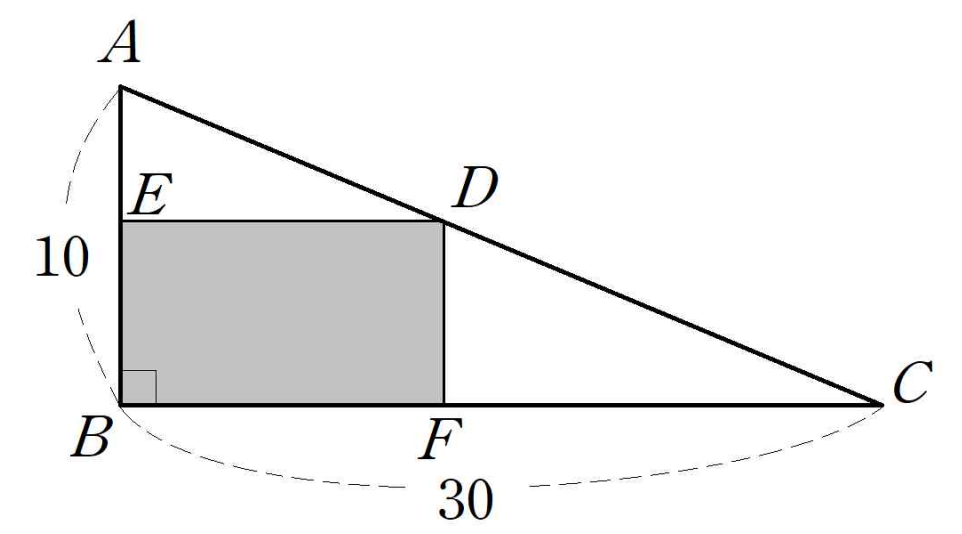

## Q
다음 그림과 같이 밑변의 길이가 $30$, 높이가 $10$인 직각삼각형 $ABC$에 내접하는 직사각형 $BFDE$를 그렸다. $\square BFDE$의 넓이가 최대일 때, $\square BFDE$의 둘레의 길이는?

## Choices
① $40$
② $42$
③ $44$
④ $46$
⑤ $48$

## Answer
①

## Solution
직각삼각형의 밑변이 $30$, 높이가 $10$이므로 빗변의 방정식은
\[
y=10-\frac{x}{3}
\]
이다. 직사각형의 가로 길이를 $x$라 하면 세로 길이는
\[
10-\frac{x}{3}
\]
이므로 넓이는
\[
S=x\left(10-\frac{x}{3}\right)=-\frac{1}{3}x^2+10x
\]
이다.

이차함수의 최댓값은 꼭짓점에서 가지므로
\[
x=\frac{-10}{2(-1/3)}=15
\]
이다. 이때 세로 길이는
\[
10-\frac{15}{3}=5
\]
이므로 둘레는
\[
2(15+5)=40
\]
이다.

따라서 정답은 ①이다.
