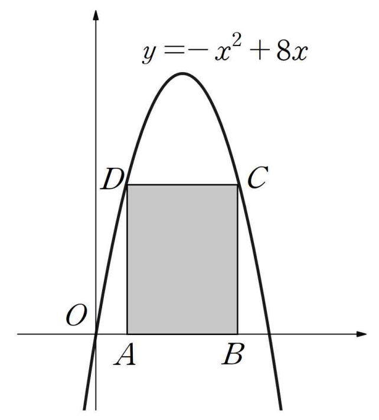

## Q
오른쪽 그림과 같이 직사각형 $ABCD$의 두 꼭짓점 $A, B$는 $x$축 위에 있고, 두 꼭짓점 $C, D$는 이차함수 $y=-x^2+8x$의 그래프 위에 있다. 직사각형 $ABCD$의 둘레의 길이의 최댓값을 구하면?

## Choices
① $34$
② $30$
③ $26$
④ $22$
⑤ $18$

## Answer
①

## Solution
포물선
\[
y=16-(x-4)^2
\]
위에 직사각형의 윗변이 놓이도록 하고, 대칭성을 이용하여 윗꼭짓점을
\[
(4-t,\,16-t^2),\qquad (4+t,\,16-t^2)
\]
라 두자. 그러면 가로 길이는
\[
2t
\]
이고 세로 길이는
\[
16-t^2
\]
이다.

둘레는
\[
P=2\{2t+(16-t^2)\}=-2t^2+4t+32
\]
이다. 이 이차함수의 최댓값은 꼭짓점에서 가지므로
\[
t=-\frac{4}{2\cdot(-2)}=1
\]
이다. 따라서 최대 둘레는
\[
-2+4+32=34
\]
이다.

따라서 정답은 ①이다.
