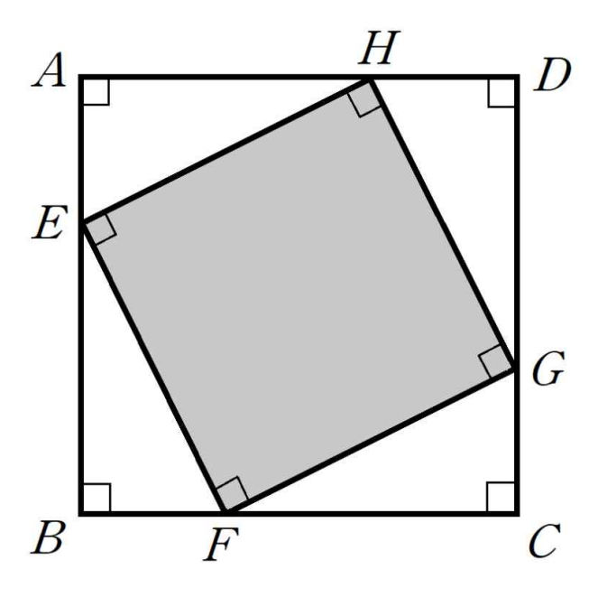

## Q
오른쪽 그림과 같이 한 변의 길이가 $8$인 정사각형 $ABCD$에 내접하는 정사각형 $EFGH$가 있다. 이때 점 $E, F, G, H$는 각각 변 $AB, BC, CD, DA$ 위에 있다. 정사각형 $EFGH$의 넓이의 최솟값을 구하시오.

## Choices

## Answer
$32$

## Solution
정사각형 $EFGH$의 한 변의 길이를 $s$, 변 $AD$와 이루는 각을 $\theta$라 하자.
정사각형 $ABCD$의 한 변의 길이가 $8$이므로
\[
s\cos\theta+s\sin\theta=8
\]
이고 따라서
\[
s=\frac{8}{\sin\theta+\cos\theta}
\]
이다. 정사각형 $EFGH$의 넓이를 $S$라 하면
\[
S=s^2=\frac{64}{(\sin\theta+\cos\theta)^2}
\]
이다. 그런데
\[
(\sin\theta+\cos\theta)^2=1+\sin2\theta\le 2
\]
이므로
\[
S\ge \frac{64}{2}=32
\]
이다. 따라서 넓이의 최솟값은 $32$이다.
