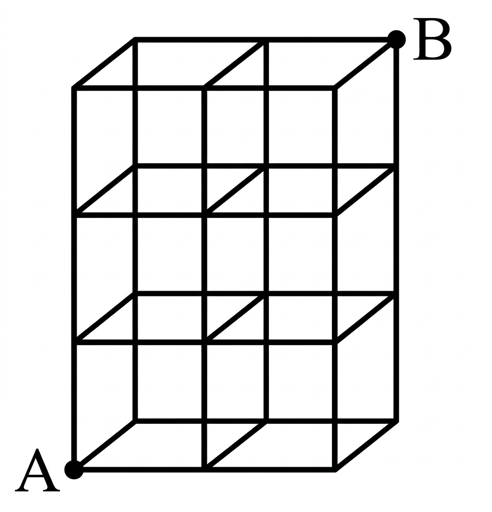

## Q
오른쪽 그림은 같은 정육면체 $6$개를 쌓아 만든 직육면체이다. 정육면체의 모서리를 따라 꼭짓점 $A$에서 꼭짓점 $B$까지 최단 거리로 가는 경우의 수는?

## Choices
① $30$
② $45$
③ $60$
④ $75$
⑤ $90$

## Answer
③

## Solution
그림에서 $A$에서 $B$까지 최단 거리로 가려면 가로로 $2$칸, 깊이 방향으로 $1$칸, 세로로 $3$칸 이동해야 한다.

따라서 이동 순서를 배열하는 경우의 수는
\[
\frac{6!}{2!\,1!\,3!}=60
\]
이다.
