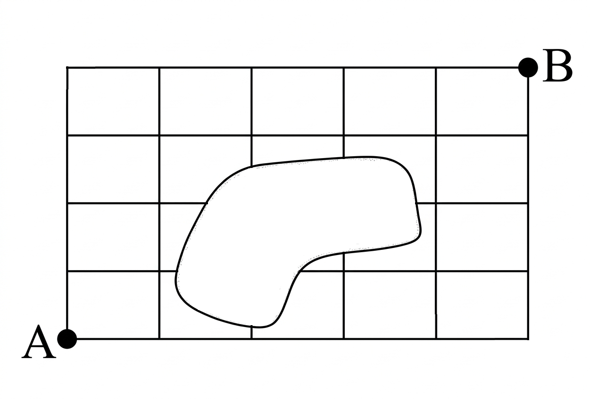

## Q
오른쪽 그림은 호수가 있는 어느 마을의 도로망이다. $A$지역에서 $B$지역까지 최단 거리로 가는 경우의 수를 구하시오.

## Choices

## Answer
$30$

## Solution
오른쪽 또는 위쪽으로만 움직이며 각 교차점까지의 최단 경로 수를 적어 가면 된다.

맨 아래 줄부터 차례로 적으면
\[
1,\ 1,\ 1,\ 1,\ 1,\ 1
\]
\[
1,\ 2,\ 0,\ 1,\ 2,\ 3
\]
\[
1,\ 3,\ 0,\ 0,\ 2,\ 5
\]
\[
1,\ 4,\ 4,\ 4,\ 6,\ 11
\]
\[
1,\ 5,\ 9,\ 13,\ 19,\ 30
\]
이다.

따라서 $B$지역까지 최단 거리로 가는 경우의 수는
\[
30
\]
이다.
