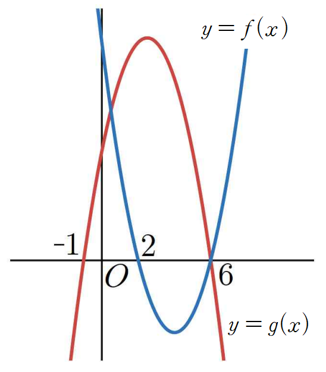

## Q
이차항의 계수가 각각 \(1\), \(-1\)인 두 이차함수 \(y=f(x)\), \(y=g(x)\)의 그래프가 다음 그림과 같을 때, 부등식
\[
f(x)g(x)\ge 0
\]
을 만족하는 정수 \(x\)의 개수는?

## Choices
① \(3\)
② \(4\)
③ \(5\)
④ \(6\)
⑤ \(7\)

## Answer
③

## Solution
그래프에서 이차항의 계수가 \(1\)인 함수는 위로 열린 포물선이고, \(x\)축과 만나는 점은
\[
x=2,\quad x=6
\]
이다.

따라서
\[
f(x)\ge 0 \quad \text{인 범위는} \quad x\le 2 \text{ 또는 } x\ge 6
\]
이다.

또 이차항의 계수가 \(-1\)인 함수는 아래로 열린 포물선이고, \(x\)축과 만나는 점은
\[
x=-1,\quad x=6
\]
이다.

따라서
\[
g(x)\ge 0 \quad \text{인 범위는} \quad -1\le x\le 6
\]
이다.

곱
\[
f(x)g(x)\ge 0
\]
이 되려면 두 값의 부호가 같거나 둘 중 하나가 \(0\)이어야 한다.

그래프에서 이를 만족하는 정수 \(x\)는
\[
-1,\ 0,\ 1,\ 2,\ 6
\]
의 \(5\)개이다.

따라서 정답은 ③이다.
