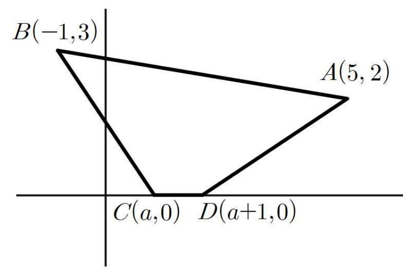

## Q
두 점 \(A(5,2)\), \(B(-1,3)\)과 \(x\)축 위를 움직이는 점 \(C(a,0)\), \(D(a+1,0)\)에 대하여 사각형 \(ABCD\)의 둘레의 길이의 최솟값은
\[
1+m\sqrt{2}+\sqrt{n}
\]
이다. 두 자연수 \(m,\ n\)에 대하여 \(m+n\)의 값을 구하시오.

(단, \(a\)는 실수이다.)

## Choices

## Answer
\(m=5,\ n=37,\ m+n=42\)

## Solution
사각형의 둘레는
\[
\overline{AB}+\overline{BC}+\overline{CD}+\overline{DA}
\]
이다.

여기서
\[
\overline{AB}
=\sqrt{(5-(-1))^2+(2-3)^2}
=\sqrt{37}
\]
이고
\[
\overline{CD}=1
\]
이다.

따라서 \(\overline{BC}+\overline{DA}\)의 최솟값만 구하면 된다.

점 \(D(a+1,0)\) 대신 점 \(C(a,0)\)를 기준으로 보면
\[
\overline{DA}=\sqrt{(a-4)^2+2^2}
\]
이다.

점 \(A'(4,2)\)를 잡으면
\[
\overline{DA}=\overline{CA'}
\]
이다.

이제 \(B(-1,3)\)를 \(x\)축에 대하여 대칭이동한 점을 \(B'(-1,-3)\)라 하면
\[
\overline{BC}=\overline{B'C}
\]
이므로
\[
\overline{BC}+\overline{DA}
=\overline{B'C}+\overline{CA'}
\ge \overline{B'A'}
\]
이다.

따라서 최솟값은
\[
\overline{B'A'}
=\sqrt{(4-(-1))^2+(2-(-3))^2}
=\sqrt{25+25}
=5\sqrt{2}
\]
이다.

그러므로 사각형 \(ABCD\)의 둘레의 최솟값은
\[
\sqrt{37}+1+5\sqrt{2}
\]
이다.

따라서
\[
m=5,\quad n=37
\]
이므로
\[
m+n=42
\]
이다.
