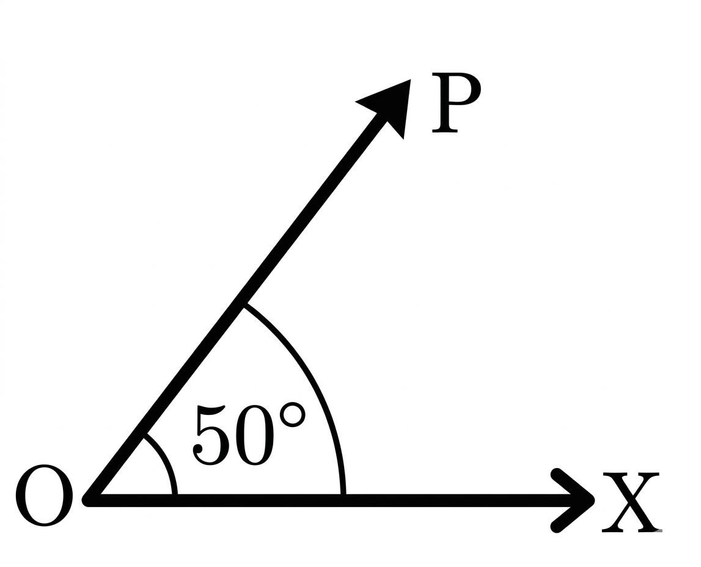

## Q
시초선 $OX$와 동경 $OP$의 위치가 오른쪽 그림과 같을 때, 다음 중 동경 $OP$가 나타내는 각이 될 수 없는 것은?

## Choices
① $-670^\circ$
② $-330^\circ$
③ $-1030^\circ$
④ $410^\circ$
⑤ $770^\circ$

## Answer
②

## Solution
$-670^\circ$, $-1030^\circ$, $410^\circ$, $770^\circ$는 모두 $50^\circ$와 동경이 같다.
반면 $-330^\circ$는 $30^\circ$와 동경이 같으므로 그림의 동경과 일치하지 않는다.
