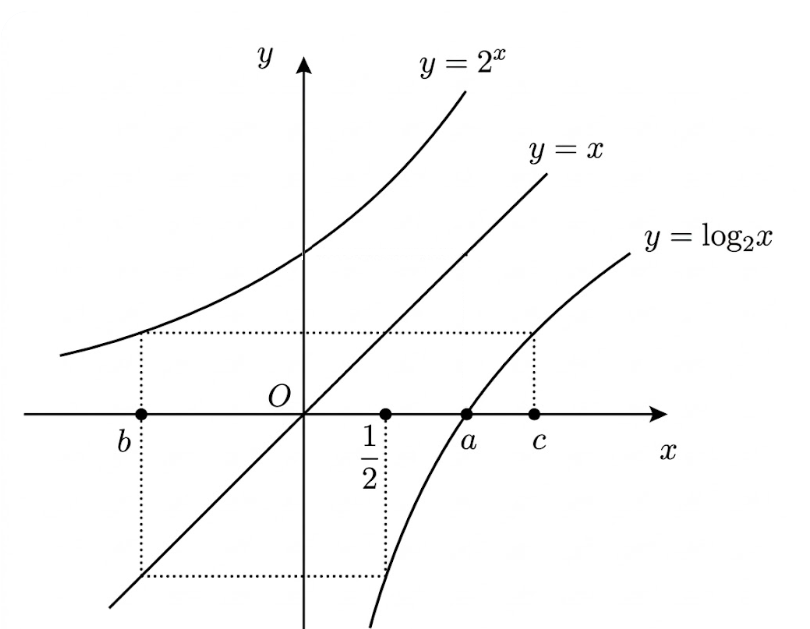

## Q
[정답지 표기 검수 필요] 원본 정답지에 `② or 3`으로 표기되어 있다.

다음 그림은 함수 $y=2^x$, $y=\log_2 x$의 그래프와 직선 $y=x$이다. $a$, $b$, $c$의 곱인 $abc$의 값은? (단, $a$, $b$, $c$는 상수)

## Choices
① $-\sqrt{3}$
② $-\sqrt{2}$
③ 1
④ $\sqrt{2}$
⑤ $\sqrt{3}$

## Answer
② 또는 ③

## Solution
원본 정답지의 표기가 `② or 3`으로 남아 있어 그래프의 문자 배치에 대한 원본 검수가 필요하다.
현재 DB에는 원본 정답지 표기를 그대로 반영하였다.
