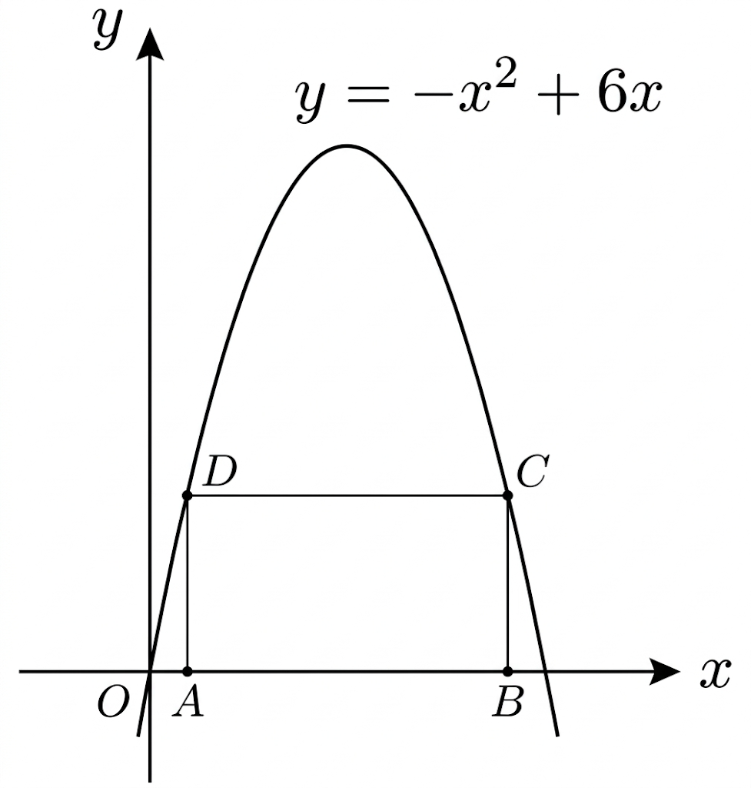

## Q
아래 그림과 같이 $x$축 위의 두 점 $A,B$와 이차함수 $y=-x^2+6x$의 그래프 위의 두 점 $C,D$를 네 꼭짓점으로 하는 직사각형 $ABCD$의 둘레의 길이의 최댓값은?

## Choices
① $8$  
② $16$  
③ $20$  
④ $28$  
⑤ $36$

## Answer
③

## Solution
$A=(t,0)$, $B=(6-t,0)$ $(0<t<3)$라 두면
$$
D=(t,-t^2+6t),\quad C=(6-t,-t^2+6t)
$$
가 되어 직사각형이 된다.
가로 길이는 $AB=6-2t$, 세로 길이는 $AD=-t^2+6t$이므로 둘레 $P$는
$$
P=2(6-2t)+2(-t^2+6t)=-2t^2+8t+12.
$$
아래로 열린 이차식이므로 최댓값은 꼭짓점에서 갖는다.
$$
t=\frac{-8}{2(-2)}=2
$$
일 때
$$
P_{\max}=-2(2)^2+8(2)+12=20.
$$
